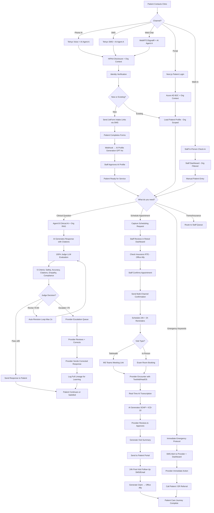
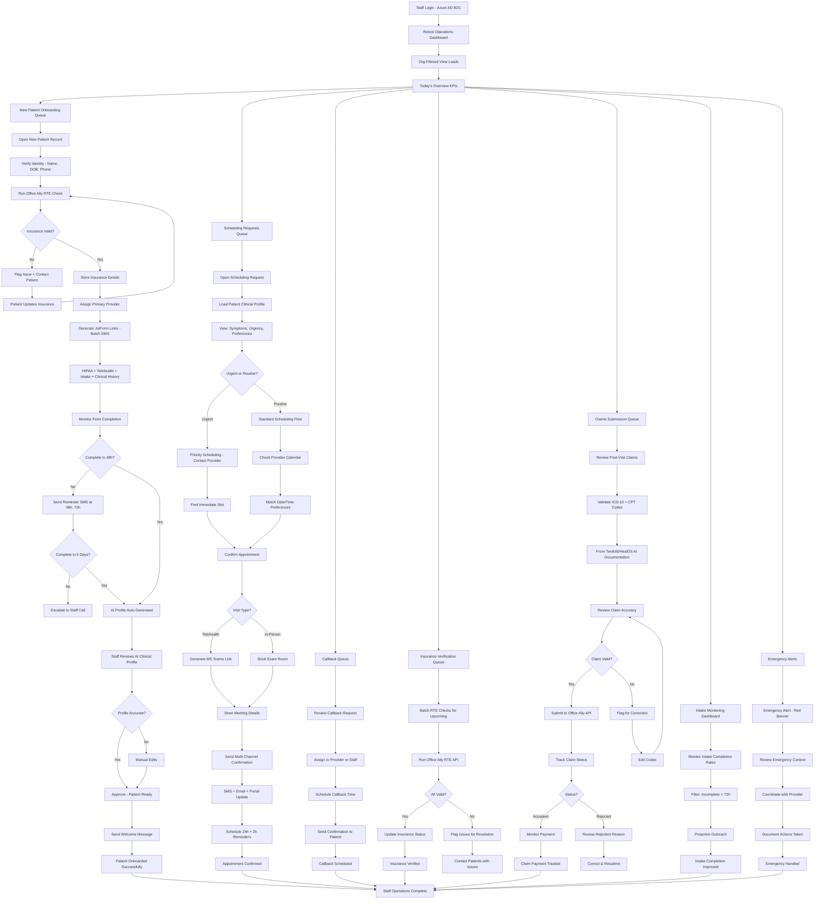
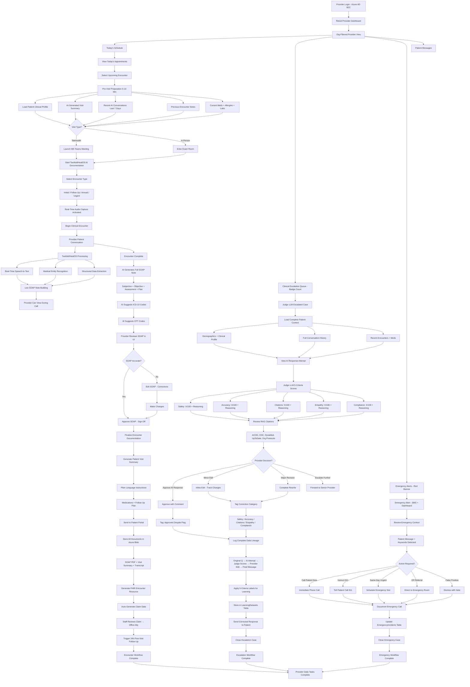

## Multi-Tenant End-to-End Patient, Staff, and Provider Journeys

---

## 1. Patient End-to-End Workflow

**Omnichannel Journey: First Contact → AI Interaction → Scheduling → Encounter → Follow-Up**

**Key Patient Touchpoints:**
- **Omnichannel Access**: 5 channels (Phone, SMS, Web, Portal, Walk-In)
- **100% AI Safety**: Judge LLM validates every clinical response
- **Unified Profile**: One profile across all channels (no data silos)
- **Smart Intake**: AI-generated clinical profiles from forms
- **Evidence-Based**: Responses cite ACOG, CDC, DynaMed, UpToDate
- **Post-Visit Engagement**: Automated follow-up templates

---

## 2. Staff End-to-End Workflow

**Centralized Operations: Patient Onboarding → Scheduling → Insurance → Claims → Monitoring**

**Key Staff Workflows:**
- **Org-Scoped Dashboard**: Multi-tenant data isolation in Retool
- **RTE Integration**: Real-time eligibility checks via Office Ally
- **Claims Management**: Complete submission and tracking workflow
- **Proactive Monitoring**: Intake completion, insurance verification
- **Emergency Coordination**: Real-time alerts and provider communication
- **Efficiency Metrics**: Time to schedule, insurance verification rate, intake completion %

---

## 3. Provider End-to-End Workflow

**Clinical Excellence: AI Escalations → Emergency Response → AI-Native Encounters → Learning Loop**

**Key Provider Workflows:**
- **Detailed Escalation Review**: Full context + Judge scores + citations + correction tagging
- **Emergency Response**: Real-time alerts with immediate action options
- **AI-Native Documentation**: Twofold/HealOS for ambient transcription (telehealth + in-person)
- **Evidence-Based Care**: RAG citations from DynaMed, UpToDate, ACOG, CDC
- **Complete Data Lineage**: Full chain from AI attempt to final message for learning
- **5-Criteria Labeling**: Safety, Accuracy, Citations, Empathy, Compliance tags
- **Seamless Billing**: Auto-generated claims from AI documentation
- **Post-Visit Automation**: Visit summary to portal + 24h follow-up triggered
