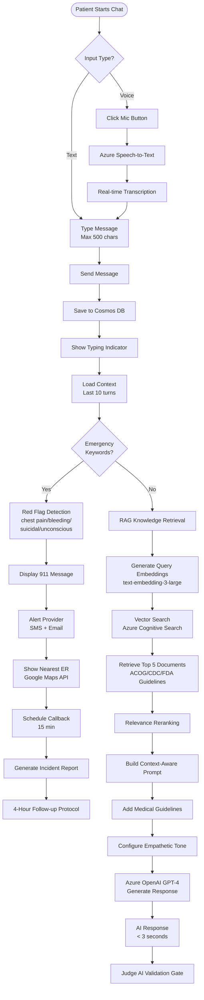
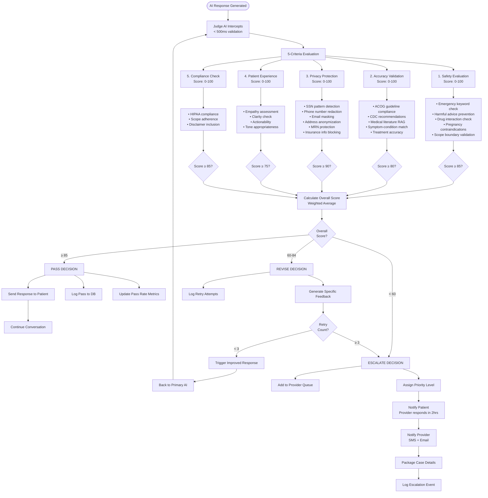
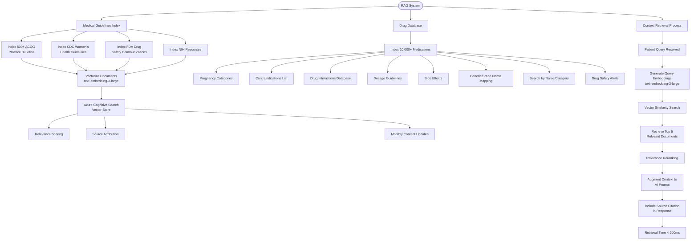
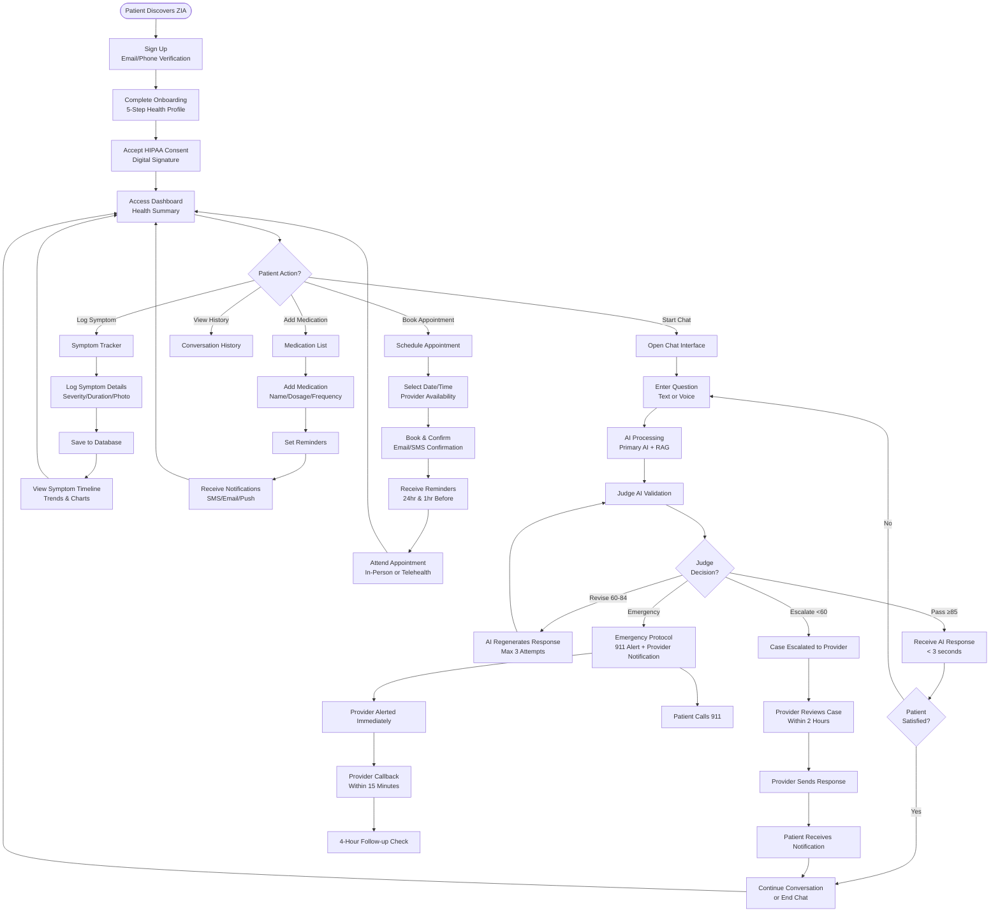
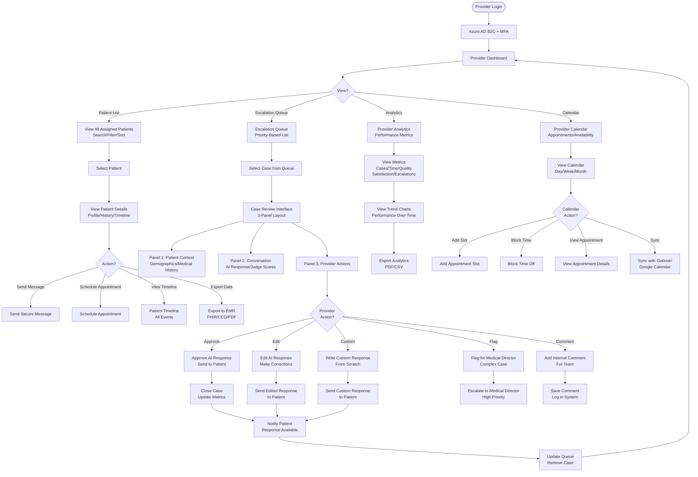
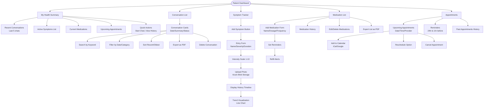
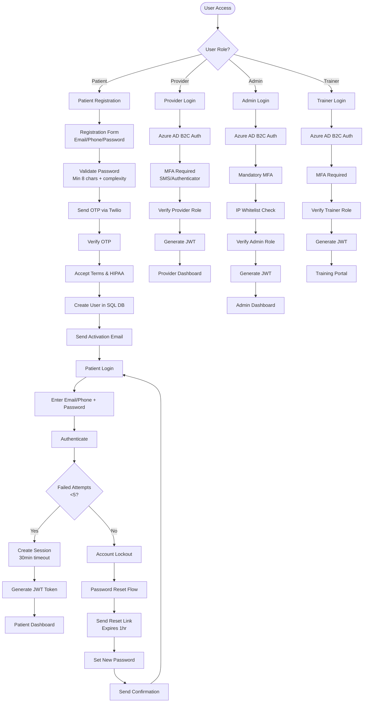
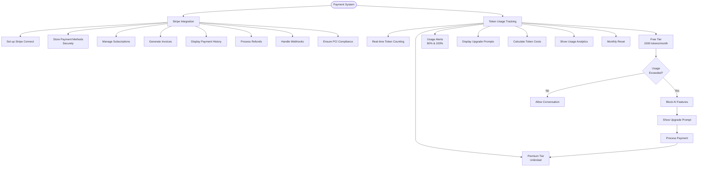

## 1. High-Level System & Data Flow Architecture

This diagram illustrates the complete end-to-end data flow, showing how users interact with the platform and how data moves between the frontend, backend services, AI layer, and external integrations.

```mermaid
graph TB
    %% User Layers
    subgraph UserLayer[User Layer]
        direction TB
        PAT[Patient]
        PROV[Provider]
        ADM[Admin]
        TRN[Trainer]
    end

    %% Frontend Layer
    subgraph FrontendLayer[Frontend Layer]
        direction TB
        WEB[Web Application<br/>React/TypeScript]
        MOB[Mobile App<br/>React Native]
        
        subgraph WebModules[Web Modules]
            PAT_WEB[Patient Portal]
            PROV_WEB[Provider Dashboard]
            ADM_WEB[Admin Dashboard]
            TRN_WEB[Training Portal]
        end
        
        subgraph MobileModules[Mobile Modules]
            PAT_MOB[Patient App]
            CHAT_MOB[Chat Interface]
            HEALTH_MOB[Health Tracking]
        end
    end

    %% API Gateway Layer
    subgraph APIGatewayLayer[API Gateway Layer]
        GW[Azure API Gateway<br/>Load Balancing & Routing]
    end

    %% Backend Services Layer
    subgraph BackendLayer[Backend Services Layer]
        direction TB
        
        subgraph CoreServices[Core Services]
            AUTH[Authentication Service<br/>Azure AD B2C]
            CHAT[Chat Service<br/>Real-time Communication]
            JUDGE[Judge AI Service<br/>Response Validation]
            RAG[RAG Service<br/>Knowledge Retrieval]
            NOTIF[Notification Service<br/>Email/SMS/Push]
        end
        
        subgraph BusinessServices[Business Services]
            PAT_SVC[Patient Service<br/>Profiles & Onboarding]
            PROV_SVC[Provider Service<br/>Case Management]
            EMER[Emergency Service<br/>Red Flag Detection]
            PAY[Payment Service<br/>Stripe Integration]
            EMR[EMR Service<br/>Health Data]
        end
        
        subgraph AIServices[AI Services]
            OPENAI[Azure OpenAI<br/>Primary LLM]
            STT[Speech-to-Text<br/>Azure Cognitive]
            TTS[Text-to-Speech<br/>Azure Cognitive]
        end
    end

    %% Data Layer
    subgraph DataLayer[Data Layer]
        direction TB
        
        subgraph Databases[Databases]
            SQL[Azure SQL DB<br/>Structured Data]
            COSMOS[Cosmos DB<br/>Conversations & Sessions]
            SEARCH[Azure Cognitive Search<br/>Vector Search]
        end
        
        subgraph Storage[Storage]
            BLOB[Azure Blob Storage<br/>Files & Images]
            KEYVAULT[Azure Key Vault<br/>Secrets & Keys]
        end
        
        subgraph ExternalData[External Data]
            FHIR[FHIR Server<br/>EMR Integration]
            MAPS[Maps API<br/>Location Services]
            HEALTH[Health APIs<br/>Apple HealthKit/Google Fit]
        end
    end

    %% External Services Layer
    subgraph ExternalLayer[External Services]
        direction TB
        TWILIO[Twilio<br/>SMS & Voice]
        STRIPE[Stripe<br/>Payments]
        TEAMS[Microsoft Teams<br/>Telehealth]
        EMR_APIS[EMR Systems<br/>Epic/Cerner/Athena]
    end

    %% Security & Monitoring Layer
    subgraph SecurityLayer[Security & Monitoring]
        direction TB
        AUDIT[Audit Logging<br/>HIPAA Compliance]
        MONITOR[System Monitoring<br/>Performance Metrics]
        ENCRYPT[Encryption<br/>TLS 1.3 & AES-256]
        BACKUP[Backup & Recovery<br/>7-year Retention]
    end

    %% Connections
    UserLayer --> FrontendLayer
    FrontendLayer --> APIGatewayLayer
    APIGatewayLayer --> BackendLayer
    BackendLayer --> DataLayer
    BackendLayer --> ExternalLayer
    BackendLayer -.-> SecurityLayer
    
    %% Internal Connections
    AUTH --> SQL
    CHAT --> COSMOS
    JUDGE --> SEARCH
    RAG --> SEARCH
    PAT_SVC --> SQL
    PROV_SVC --> SQL
    EMER --> BLOB
    PAY --> KEYVAULT
    
    %% AI Connections
    CHAT --> OPENAI
    CHAT --> STT
    CHAT --> TTS
    JUDGE --> OPENAI
    
    %% External Integrations
    NOTIF --> TWILIO
    PAY --> STRIPE
    PROV_SVC --> TEAMS
    EMR --> EMR_APIS
    EMR --> FHIR
    
    %% Security Connections
    AUTH --> ENCRYPT
    AUDIT --> SQL
    MONITOR --> COSMOS

    %% Styling
    classDef userClass fill:#e1f5fe
    classDef frontendClass fill:#f3e5f5
    classDef backendClass fill:#e8f5e8
    classDef dataClass fill:#fff3e0
    classDef externalClass fill:#ffebee
    classDef securityClass fill:#fce4ec
    
    class PAT,PROV,ADM,TRN userClass
    class WEB,MOB,WebModules,MobileModules frontendClass
    class CoreServices,BusinessServices,AIServices backendClass
    class Databases,Storage,ExternalData dataClass
    class ExternalLayer externalClass
    class SecurityLayer securityClass
```

## 2. Core AI & Data Processing Flows

This section details the critical AI-driven processes at the heart of the platform.

### 2.1. Conversational AI Flow

This flow charts the path of a patient's message from input to the generation of a validated AI response.

```mermaid
flowchart TD
    START([Patient Starts Chat]) --> INPUT{Input Type?}
    
    INPUT -->|Text| TEXTINPUT[Type Message<br/>Max 500 chars]
    INPUT -->|Voice| VOICEINPUT[Click Mic Button]
    
    VOICEINPUT --> STT[Azure Speech-to-Text]
    STT --> TRANSCRIBE[Real-time Transcription]
    TRANSCRIBE --> TEXTINPUT
    
    TEXTINPUT --> SEND[Send Message]
    SEND --> SAVEUSER[Save to Cosmos DB]
    SAVEUSER --> TYPING[Show Typing Indicator]
    
    TYPING --> CONTEXT[Load Context<br/>Last 10 turns]
    CONTEXT --> EMERGENCY{Emergency<br/>Keywords?}
    
    EMERGENCY -->|Yes| REDFLAG[Red Flag Detection<br/>chest pain/bleeding/<br/>suicidal/unconscious]
    REDFLAG --> ALERT911[Display 911 Message]
    ALERT911 --> ALERTPROV[Alert Provider<br/>SMS + Email]
    ALERTPROV --> SHOWMAP[Show Nearest ER<br/>Google Maps API]
    SHOWMAP --> CALLBACK[Schedule Callback<br/>15 min]
    CALLBACK --> INCIDENT[Generate Incident Report]
    INCIDENT --> FOLLOWUP[4-Hour Follow-up Protocol]
    
    EMERGENCY -->|No| RAG[RAG Knowledge Retrieval]
    RAG --> EMBED[Generate Query Embeddings<br/>text-embedding-3-large]
    EMBED --> SEARCH[Vector Search<br/>Azure Cognitive Search]
    SEARCH --> RETRIEVE[Retrieve Top 5 Documents<br/>ACOG/CDC/FDA Guidelines]
    RETRIEVE --> RERANK[Relevance Reranking]
    
    RERANK --> PROMPT[Build Context-Aware Prompt]
    PROMPT --> GUIDELINES[Add Medical Guidelines]
    GUIDELINES --> TONE[Configure Empathetic Tone]
    TONE --> PRIMARY[Azure OpenAI GPT-4<br/>Generate Response]
    PRIMARY --> RESPONSE[AI Response<br/>< 3 seconds]
    
    RESPONSE --> JUDGE[Judge AI Validation Gate]
```

### 2.2. Judge AI System Flow

The Judge AI is a critical safety and quality component. This diagram shows how every AI response is evaluated against 5 core criteria before being sent to the patient.

```mermaid
flowchart TD
    START([AI Response Generated]) --> INTERCEPT[Judge AI Intercepts<br/>< 500ms validation]
    
    INTERCEPT --> EVAL[5-Criteria Evaluation]
    
    EVAL --> SAFETY[1. Safety Evaluation<br/>Score: 0-100]
    EVAL --> ACCURACY[2. Accuracy Validation<br/>Score: 0-100]
    EVAL --> PRIVACY[3. Privacy Protection<br/>Score: 0-100]
    EVAL --> EXPERIENCE[4. Patient Experience<br/>Score: 0-100]
    EVAL --> COMPLIANCE[5. Compliance Check<br/>Score: 0-100]
    
    SAFETY --> SAFECHECKS[• Emergency keyword check<br/>• Harmful advice prevention<br/>• Drug interaction check<br/>• Pregnancy contraindications<br/>• Scope boundary validation]
    SAFECHECKS --> SAFESCORE{Score ≥ 85?}
    
    ACCURACY --> ACCCHECKS[• ACOG guideline compliance<br/>• CDC recommendations<br/>• Medical literature RAG<br/>• Symptom-condition match<br/>• Treatment accuracy]
    ACCCHECKS --> ACCSCORE{Score ≥ 80?}
    
    PRIVACY --> PRIVCHECKS[• SSN pattern detection<br/>• Phone number redaction<br/>• Email masking<br/>• Address anonymization<br/>• MRN protection<br/>• Insurance info blocking]
    PRIVCHECKS --> PRIVSCORE{Score ≥ 90?}
    
    EXPERIENCE --> EXPCHECKS[• Empathy assessment<br/>• Clarity check<br/>• Actionability<br/>• Tone appropriateness]
    EXPCHECKS --> EXPSCORE{Score ≥ 75?}
    
    COMPLIANCE --> COMPCHECKS[• HIPAA compliance<br/>• Scope adherence<br/>• Disclaimer inclusion]
    COMPCHECKS --> COMPSCORE{Score ≥ 85?}
    
    SAFESCORE --> OVERALL
    ACCSCORE --> OVERALL
    PRIVSCORE --> OVERALL
    EXPSCORE --> OVERALL
    COMPSCORE --> OVERALL
    
    OVERALL[Calculate Overall Score<br/>Weighted Average] --> DECISION{Overall<br/>Score?}
    
    DECISION -->|≥ 85| PASS[PASS DECISION]
    DECISION -->|60-84| REVISE[REVISE DECISION]
    DECISION -->|< 60| ESCALATE[ESCALATE DECISION]
    
    PASS --> SENDPATIENT[Send Response to Patient]
    PASS --> LOGPASS[Log Pass to DB]
    PASS --> METRICS[Update Pass Rate Metrics]
    SENDPATIENT --> CONTINUE[Continue Conversation]
    
    REVISE --> FEEDBACK[Generate Specific Feedback]
    FEEDBACK --> RETRY{Retry<br/>Count?}
    RETRY -->|< 3| REGENERATE[Trigger Improved Response]
    REGENERATE --> PRIMARY[Back to Primary AI]
    PRIMARY --> INTERCEPT
    RETRY -->|≥ 3| ESCALATE
    REVISE --> LOGRETRY[Log Retry Attempts]
    
    ESCALATE --> ADDQUEUE[Add to Provider Queue]
    ESCALATE --> PRIORITY[Assign Priority Level]
    PRIORITY --> NOTIFYPAT[Notify Patient<br/>Provider responds in 2hrs]
    NOTIFYPAT --> NOTIFYPROV[Notify Provider<br/>SMS + Email]
    NOTIFYPROV --> PACKAGE[Package Case Details]
    PACKAGE --> LOGESC[Log Escalation Event]
```

### 2.3. RAG Knowledge Base Flow

This flow explains how the Retrieval-Augmented Generation (RAG) system grounds the AI's responses in a curated knowledge base of medical guidelines and drug information.

```mermaid
flowchart TD
    START([RAG System]) --> INDEX[Medical Guidelines Index]
    
    INDEX --> ACOG[Index 500+ ACOG<br/>Practice Bulletins]
    INDEX --> CDC[Index CDC Women's<br/>Health Guidelines]
    INDEX --> FDA[Index FDA Drug<br/>Safety Communications]
    INDEX --> NIH[Index NIH Resources]
    
    ACOG --> VECTORIZE[Vectorize Documents<br/>text-embedding-3-large]
    CDC --> VECTORIZE
    FDA --> VECTORIZE
    NIH --> VECTORIZE
    
    VECTORIZE --> COGSEARCH[Azure Cognitive Search<br/>Vector Store]
    COGSEARCH --> RELEVANCE[Relevance Scoring]
    COGSEARCH --> SOURCE[Source Attribution]
    COGSEARCH --> UPDATE[Monthly Content Updates]
    
    START --> DRUGDB[Drug Database]
    DRUGDB --> INDEXDRUGS[Index 10,000+ Medications]
    INDEXDRUGS --> PREGCAT[Pregnancy Categories]
    INDEXDRUGS --> CONTRA[Contraindications List]
    INDEXDRUGS --> INTERACT[Drug Interactions Database]
    INDEXDRUGS --> DOSAGE[Dosage Guidelines]
    INDEXDRUGS --> SIDEEFFECTS[Side Effects]
    INDEXDRUGS --> NAMES[Generic/Brand Name Mapping]
    INDEXDRUGS --> SEARCHDRUG[Search by Name/Category]
    INDEXDRUGS --> ALERTS[Drug Safety Alerts]
    
    START --> RETRIEVAL[Context Retrieval Process]
    RETRIEVAL --> QUERY[Patient Query Received]
    QUERY --> EMBEDQUERY[Generate Query Embeddings<br/>text-embedding-3-large]
    EMBEDQUERY --> VECSEARCH[Vector Similarity Search]
    VECSEARCH --> TOP5[Retrieve Top 5<br/>Relevant Documents]
    TOP5 --> RERANK[Relevance Reranking]
    RERANK --> AUGMENT[Augment Context to<br/>AI Prompt]
    AUGMENT --> CITE[Include Source Citation<br/>in Response]
    CITE --> TIMING[Retrieval Time < 200ms]
```

---

## 3. User Journeys & Workflows

This section visualizes the end-to-end experience for each user role within the ZIA platform.

### 3.1. End-to-End Patient Journey

From discovery and onboarding to interacting with the AI and managing their health, this flow maps the complete patient experience.

```mermaid
flowchart TD
    START([Patient Discovers ZIA]) --> SIGNUP[Sign Up<br/>Email/Phone Verification]
    SIGNUP --> ONBOARD[Complete Onboarding<br/>5-Step Health Profile]
    ONBOARD --> CONSENT[Accept HIPAA Consent<br/>Digital Signature]
    CONSENT --> DASHBOARD[Access Dashboard<br/>Health Summary]
    
    DASHBOARD --> ACTION{Patient Action?}
    
    ACTION -->|Start Chat| CHAT[Open Chat Interface]
    ACTION -->|Log Symptom| SYMPTOM[Symptom Tracker]
    ACTION -->|Add Medication| MEDICATION[Medication List]
    ACTION -->|Book Appointment| APPOINTMENT[Schedule Appointment]
    ACTION -->|View History| HISTORY[Conversation History]
    
    CHAT --> INPUTCHAT[Enter Question<br/>Text or Voice]
    INPUTCHAT --> AIPROCESS[AI Processing<br/>Primary AI + RAG]
    AIPROCESS --> JUDGECHECK[Judge AI Validation]
    
    JUDGECHECK --> DECISION{Judge<br/>Decision?}
    
    DECISION -->|Pass ≥85| RESPONSE[Receive AI Response<br/>< 3 seconds]
    DECISION -->|Revise 60-84| RETRY[AI Regenerates Response<br/>Max 3 Attempts]
    DECISION -->|Escalate <60| ESCALATION[Case Escalated to Provider]
    DECISION -->|Emergency| EMERGENCY[Emergency Protocol<br/>911 Alert + Provider Notification]
    
    RETRY --> JUDGECHECK
    
    RESPONSE --> SATISFIED{Patient<br/>Satisfied?}
    SATISFIED -->|Yes| FOLLOWUP[Continue Conversation<br/>or End Chat]
    SATISFIED -->|No| INPUTCHAT
    
    ESCALATION --> PROVREVIEW[Provider Reviews Case<br/>Within 2 Hours]
    PROVREVIEW --> PROVRESPONSE[Provider Sends Response]
    PROVRESPONSE --> PATNOTIF[Patient Receives Notification]
    PATNOTIF --> FOLLOWUP
    
    EMERGENCY --> CALL911[Patient Calls 911]
    EMERGENCY --> PROVEMERG[Provider Alerted Immediately]
    PROVEMERG --> CALLBACK[Provider Callback<br/>Within 15 Minutes]
    CALLBACK --> FOLLOWUPEMERG[4-Hour Follow-up Check]
    
    SYMPTOM --> LOGSYMPTOM[Log Symptom Details<br/>Severity/Duration/Photo]
    LOGSYMPTOM --> SAVEDB[Save to Database]
    SAVEDB --> TIMELINE[View Symptom Timeline<br/>Trends & Charts]
    
    MEDICATION --> ADDMED[Add Medication<br/>Name/Dosage/Frequency]
    ADDMED --> SETREMINDER[Set Reminders]
    SETREMINDER --> NOTIFICATION[Receive Notifications<br/>SMS/Email/Push]
    
    APPOINTMENT --> SELECTSLOT[Select Date/Time<br/>Provider Availability]
    SELECTSLOT --> BOOKCONFIRM[Book & Confirm<br/>Email/SMS Confirmation]
    BOOKCONFIRM --> REMINDER[Receive Reminders<br/>24hr & 1hr Before]
    REMINDER --> ATTEND[Attend Appointment<br/>In-Person or Telehealth]
    
    FOLLOWUP --> DASHBOARD
    TIMELINE --> DASHBOARD
    NOTIFICATION --> DASHBOARD
    ATTEND --> DASHBOARD
```

### 3.2. Provider Workflow Journey

This diagram outlines how a provider interacts with the platform, focusing on managing patients and reviewing escalated cases.

```mermaid
flowchart TD
    START([Provider Login]) --> AUTH[Azure AD B2C + MFA]
    AUTH --> PROVDASH[Provider Dashboard]
    
    PROVDASH --> VIEW{View?}
    
    VIEW -->|Patient List| PATIENTS[View All Assigned Patients<br/>Search/Filter/Sort]
    VIEW -->|Escalation Queue| QUEUE[Escalation Queue<br/>Priority-Based List]
    VIEW -->|Analytics| ANALYTICS[Provider Analytics<br/>Performance Metrics]
    VIEW -->|Calendar| CALENDAR[Provider Calendar<br/>Appointments/Availability]
    
    PATIENTS --> SELECTPAT[Select Patient]
    SELECTPAT --> PATDETAIL[View Patient Details<br/>Profile/History/Timeline]
    PATDETAIL --> PATACTION{Action?}
    PATACTION -->|Send Message| MESSAGE[Send Secure Message]
    PATACTION -->|Schedule Appointment| SCHEDAPPT[Schedule Appointment]
    PATACTION -->|View Timeline| TIMELINE[Patient Timeline<br/>All Events]
    PATACTION -->|Export Data| EXPORT[Export to EMR<br/>FHIR/CCD/PDF]
    
    QUEUE --> SELECTCASE[Select Case from Queue]
    SELECTCASE --> CASEREVIEW[Case Review Interface<br/>3-Panel Layout]
    
    CASEREVIEW --> PANEL1[Panel 1: Patient Context<br/>Demographics/Medical History]
    CASEREVIEW --> PANEL2[Panel 2: Conversation<br/>AI Response/Judge Scores]
    CASEREVIEW --> PANEL3[Panel 3: Provider Actions]
    
    PANEL3 --> PROVACTION{Provider<br/>Action?}
    
    PROVACTION -->|Approve| APPROVE[Approve AI Response<br/>Send to Patient]
    PROVACTION -->|Edit| EDIT[Edit AI Response<br/>Make Corrections]
    PROVACTION -->|Custom| CUSTOM[Write Custom Response<br/>From Scratch]
    PROVACTION -->|Flag| FLAG[Flag for Medical Director<br/>Complex Case]
    PROVACTION -->|Comment| COMMENT[Add Internal Comment<br/>For Team]
    
    APPROVE --> CLOSECASE[Close Case<br/>Update Metrics]
    EDIT --> SENDEDITED[Send Edited Response<br/>to Patient]
    CUSTOM --> SENDCUSTOM[Send Custom Response<br/>to Patient]
    FLAG --> ESCALATEMD[Escalate to Medical Director<br/>High Priority]
    COMMENT --> SAVECOMMENT[Save Comment<br/>Log in System]
    
    CLOSECASE --> NOTIFYPAT[Notify Patient<br/>Response Available]
    SENDEDITED --> NOTIFYPAT
    SENDCUSTOM --> NOTIFYPAT
    
    NOTIFYPAT --> UPDATEQUEUE[Update Queue<br/>Remove Case]
    UPDATEQUEUE --> PROVDASH
    
    ANALYTICS --> VIEWMETRICS[View Metrics<br/>Cases/Time/Quality<br/>Satisfaction/Escalations]
    VIEWMETRICS --> TRENDS[View Trend Charts<br/>Performance Over Time]
    TRENDS --> EXPORTANALYTICS[Export Analytics<br/>PDF/CSV]
    
    CALENDAR --> VIEWCAL[View Calendar<br/>Day/Week/Month]
    VIEWCAL --> CALACTION{Calendar<br/>Action?}
    CALACTION -->|Add Slot| ADDSLOT[Add Appointment Slot]
    CALACTION -->|Block Time| BLOCKTIME[Block Time Off]
    CALACTION -->|View Appointment| VIEWAPPT[View Appointment Details]
    CALACTION -->|Sync| SYNCCAL[Sync with Outlook/<br/>Google Calendar]
```

### 3.3. Admin Workflow Journey

This flow shows how an administrator manages the entire platform, including user management, system configuration, and monitoring.

```mermaid
flowchart TD
    START([Admin Login]) --> AUTH[Azure AD B2C + MFA<br/>IP Whitelist Check]
    AUTH --> ADMINDASH[Admin Dashboard]
    
    ADMINDASH --> SECTION{Admin<br/>Section?}
    
    SECTION -->|User Management| USERS[User Management]
    SECTION -->|System Analytics| SYSANALYTICS[System Analytics]
    SECTION -->|Judge Config| JUDGECONFIG[Judge Configuration]
    SECTION -->|Emergency Keywords| KEYWORDS[Emergency Keywords]
    SECTION -->|System Health| HEALTH[System Health Monitor]
    SECTION -->|Audit Logs| AUDIT[Audit Logs]
    
    USERS --> USERLIST[View All Users<br/>Patients/Providers/Admins/Trainers]
    USERLIST --> USERACTION{User<br/>Action?}
    USERACTION -->|Add User| ADDUSER[Add New User<br/>Assign Role]
    USERACTION -->|Edit User| EDITUSER[Edit User Details<br/>Update Info]
    USERACTION -->|Activate/Deactivate| TOGGLE[Activate or Deactivate<br/>User Account]
    USERACTION -->|Bulk Import| BULKIMPORT[Bulk Import Users<br/>CSV Upload]
    USERACTION -->|View Activity| ACTIVITY[View User Activity Logs]
    
    SYSANALYTICS --> METRICS[View System Metrics]
    METRICS --> TOTALUSERS[Total Users Count]
    METRICS --> ACTIVEUSERS[Active Users<br/>Today/Week/Month]
    METRICS --> SIGNUPS[New Signups Trend]
    METRICS --> CONVERSATIONS[Conversation Volume]
    METRICS --> PASSRATE[Judge Pass Rate]
    METRICS --> ESCALATIONS[Escalation Rate by Category]
    METRICS --> EMERGENCIES[Emergency Detection Accuracy]
    METRICS --> TOKENS[Token Usage Metrics]
    METRICS --> EXPORTMETRICS[Export Analytics CSV]
    
    JUDGECONFIG --> CONFIGUI[Configuration UI]
    CONFIGUI --> WEIGHTS[Adjust Criteria Weights<br/>Safety/Accuracy/Privacy<br/>Experience/Compliance]
    CONFIGUI --> THRESHOLDS[Set Decision Thresholds<br/>Pass/Revise/Escalate]
    CONFIGUI --> SAVECONFIG[Save Configuration<br/>Version Control]
    CONFIGUI --> PREVIEWCONFIG[Preview Changes<br/>Test on Sample Cases]
    CONFIGUI --> DEPLOYCONFIG[Deploy Configuration<br/>to Production]
    CONFIGUI --> ROLLBACKCONFIG[Rollback to Previous<br/>Configuration]
    
    KEYWORDS --> KEYWORDLIST[View Keyword List<br/>By Category]
    KEYWORDLIST --> KEYACTION{Keyword<br/>Action?}
    KEYACTION -->|Add| ADDKEY[Add New Keyword<br/>Set Category/Sensitivity]
    KEYACTION -->|Edit| EDITKEY[Edit Keyword<br/>Update Settings]
    KEYACTION -->|Delete| DELETEKEY[Delete Keyword<br/>Confirm Removal]
    KEYACTION -->|Test| TESTKEY[Test Keyword Detection<br/>Sample Queries]
    KEYACTION -->|View Analytics| KEYANALYTICS[View Trigger Count<br/>False Positive Rate]
    
    HEALTH --> HEALTHDASH[System Health Dashboard]
    HEALTHDASH --> APIRESPONSE[API Response Time Chart]
    HEALTHDASH --> DBPERF[Database Performance]
    HEALTHDASH --> AISTATUS[AI Service Status<br/>Primary/Judge]
    HEALTHDASH --> ERRORRATE[Error Rate Monitoring]
    HEALTHDASH --> SESSIONS[Active Sessions Count]
    HEALTHDASH --> QUEUES[Queue Depths]
    HEALTHDASH --> UPTIME[System Uptime %]
    HEALTHDASH --> ALERTRULES[Configure Alert Rules<br/>Thresholds/Notifications]
    
    AUDIT --> AUDITLOGS[View Audit Logs]
    AUDITLOGS --> SEARCHLOGS[Search Logs<br/>User/Action/Date]
    AUDITLOGS --> FILTERLOGS[Filter by Type<br/>Auth/Data Access<br/>Config Change]
    AUDITLOGS --> EXPORTLOGS[Export Logs<br/>CSV for Compliance]
    AUDITLOGS --> COMPLIANCE[Generate Compliance Reports<br/>HIPAA/SOC2]
```

### 3.4. Trainer Workflow Journey 

This comprehensive flow details the activities of a trainer, whose role is to review AI responses, provide feedback, manage test scenarios, and contribute to the continuous improvement of the AI models.

```mermaid
flowchart TD
    START([Trainer Login]) --> AUTH[Azure AD B2C + MFA]
    AUTH --> TRAINDASH[Training Dashboard]
    
    TRAINDASH --> STATS[View Dashboard Stats<br/>Cases/Time/Quality<br/>Earnings/Ranking]
    
    TRAINDASH --> SECTION{Trainer<br/>Section?}
    
    SECTION -->|Review Queue| QUEUE[Review Queue]
    SECTION -->|Test Library| TESTLIB[Test Scenario Library]
    SECTION -->|Configuration| CONFIG[Configuration Management]
    SECTION -->|Prompts| PROMPTS[Prompt Management]
    SECTION -->|Keywords| KEYWORDS[Emergency Keywords]
    SECTION -->|Analytics| ANALYTICS[Trainer Analytics]
    SECTION -->|Compensation| COMPENSATION[Compensation Tracking]
    SECTION -->|Retraining| RETRAIN[Retraining Pipeline]
    
    QUEUE --> QUEUELIST[View Queue List<br/>Priority-Based]
    QUEUELIST --> SELECTCASE[Select Case to Review]
    SELECTCASE --> CASEREVIEW[Case Review Interface<br/>3-Panel Layout]
    
    CASEREVIEW --> REVIEWPANELS[View All Panels<br/>Context/Conversation/Actions]
    REVIEWPANELS --> JUDGEDETAIL[Review Judge Scores<br/>5 Criteria Breakdown]
    JUDGEDETAIL --> TRAINERACTION{Trainer<br/>Action?}
    
    TRAINERACTION -->|Approve| APPROVE[Approve Judge Decision<br/>Mark as Correct]
    TRAINERACTION -->|Better Response| BETTER[Provide Better Response<br/>Rich Text Editor]
    TRAINERACTION -->|Flag| FLAG[Flag Issue<br/>Escalate to Medical Director]
    TRAINERACTION -->|Comment| COMMENT[Add Comment<br/>Feedback for ML Team]
    TRAINERACTION -->|Rate| RATE[Rate Response<br/>1-5 Stars]
    TRAINERACTION -->|Training Example| TRAINING[Mark as Training Example<br/>Add to Dataset]
    TRAINERACTION -->|Test Library| ADDTEST[Add to Test Library<br/>Create Test Case]
    
    BETTER --> EDITOR[Open Rich Text Editor<br/>Lexical with Markdown]
    EDITOR --> WRITEFEEDBACK[Write Better Response<br/>150-500 Words]
    WRITEFEEDBACK --> SELECTCAT[Select Feedback Category<br/>Accuracy/Safety/Tone/etc]
    SELECTCAT --> REASONING[Provide Reasoning<br/>Required Field]
    REASONING --> AUTOSAVE[Auto-save Draft<br/>Every 30 Seconds]
    AUTOSAVE --> SUBMITFEEDBACK[Submit Feedback]
    SUBMITFEEDBACK --> UPDATECASE[Update Case Status<br/>Log Feedback]
    
    APPROVE --> UPDATECASE
    FLAG --> UPDATECASE
    COMMENT --> UPDATECASE
    RATE --> UPDATECASE
    TRAINING --> UPDATECASE
    ADDTEST --> UPDATECASE
    
    UPDATECASE --> NEXTCASE[Move to Next Case<br/>or Return to Queue]
    
    TESTLIB --> SCENARIOS[View Scenario Library<br/>All Test Cases]
    SCENARIOS --> TESTACTION{Test<br/>Action?}
    TESTACTION -->|Upload| UPLOAD[Upload Test Cases<br/>CSV/JSON Bulk Import]
    TESTACTION -->|Create| CREATE[Create Individual Scenario<br/>Expected Response]
    TESTACTION -->|Edit| EDIT[Edit Scenario<br/>Update Details]
    TESTACTION -->|Run Tests| RUNTESTS[Execute Test Suite]
    
    RUNTESTS --> SELECTMODEL[Select Model Version<br/>Production/Candidate]
    SELECTMODEL --> EXECUTE[Run Tests<br/>Real-time Progress]
    EXECUTE --> RESULTS[View Results<br/>Comparison Report]
    RESULTS --> PASSRATE[Pass/Fail Rate<br/>Score Distribution]
    PASSRATE --> REGRESSION[Regression Detection<br/>Highlight Issues]
    REGRESSION --> DECISION{Approve<br/>Deployment?}
    DECISION -->|Yes| DEPLOY[Approve for Deployment<br/>If Pass Rate >95%]
    DECISION -->|No| MORETRAINING[More Training Needed<br/>Flag Issues]
    
    CONFIG --> CONFIGUI[Configuration UI]
    CONFIGUI --> ADJUSTWEIGHTS[Adjust Judge Weights<br/>Criteria Sliders]
    CONFIGUI --> SETTHRESH[Set Thresholds<br/>Pass/Revise/Escalate]
    CONFIGUI --> SAVEVERSION[Save Config Version<br/>Git-Backed]
    CONFIGUI --> VIEWHISTORY[View Config History<br/>All Changes]
    CONFIGUI --> ROLLBACK[Rollback Configuration<br/>Previous Version]
    CONFIGUI --> ABSETUP[A/B Testing Setup<br/>Traffic Split]
    
    PROMPTS --> PROMPTEDITOR[Prompt Editor]
    PROMPTEDITOR --> EDITPRIMARY[Edit Primary AI Prompt<br/>Syntax Highlighting]
    PROMPTEDITOR --> EDITJUDGE[Edit Judge Prompt<br/>Evaluation Template]
    PROMPTEDITOR --> VERSIONCONTROL[Version Control<br/>Git Integration]
    PROMPTEDITOR --> PREVIEWPROMPT[Preview on Sample Cases<br/>Test Before Deploy]
    PROMPTEDITOR --> DEPLOYPROMPT[Deploy Prompt<br/>to Production]
    PROMPTEDITOR --> ROLLBACKPROMPT[Rollback Prompt<br/>Previous Version]
    
    KEYWORDS --> KEYWORDMGMT[Keyword Management UI]
    KEYWORDMGMT --> ADDKEY[Add/Edit/Remove Keywords]
    KEYWORDMGMT --> SENSITIVITY[Adjust Sensitivity<br/>Exact/Fuzzy]
    KEYWORDMGMT --> CONTEXTRULES[Define Context Rules<br/>Trigger Conditions]
    KEYWORDMGMT --> TESTKEYWORDS[Test Keywords<br/>Sample Queries]
    KEYWORDMGMT --> VIEWKEYANALYTICS[View Keyword Analytics<br/>Trigger Stats]
    
    ANALYTICS --> VIEWANALYTICS[View Analytics Dashboard]
    VIEWANALYTICS --> TRAINERMETRICS[Trainer Metrics<br/>Personal Performance]
    VIEWANALYTICS --> MODELMETRICS[Model Performance<br/>System-wide Stats]
    VIEWANALYTICS --> CHARTS[View Charts<br/>Trends/Distributions]
    VIEWANALYTICS --> EXPORTANALYTICS[Export Analytics<br/>CSV Reports]
    
    COMPENSATION --> VIEWCOMP[View Compensation Dashboard]
    VIEWCOMP --> STRUCTURE[Payment Structure<br/>Base + Bonuses]
    VIEWCOMP --> TRACKING[Automatic Tracking<br/>Cases/Time/Quality]
    VIEWCOMP --> MONTHLY[Monthly Total<br/>Earnings Breakdown]
    VIEWCOMP --> BONUS[Bonus Eligibility<br/>Progress Indicator]
    VIEWCOMP --> HISTORY[Payment History<br/>Past Payments]
    VIEWCOMP --> INVOICE[Generate Invoice<br/>PDF Download]
    VIEWCOMP --> PAYOUT[Stripe Payout<br/>Monthly Transfer]
    
    RETRAIN --> RETRAINPIPELINE[Retraining Pipeline Dashboard]
    RETRAINPIPELINE --> AGGREGATE[Aggregate Feedback<br/>All Trainer Input]
    AGGREGATE --> DETECTPATTERNS[Detect Error Patterns<br/>Common Issues]
    DETECTPATTERNS --> EXPORTDATA[Export Training Data<br/>JSONL Format]
    EXPORTDATA --> VIEWCOUNTER[View Retraining Counter<br/>New Examples Count]
    VIEWCOUNTER --> TRIGGERJOB[Trigger Retraining Job<br/>Manual Start]
    TRIGGERJOB --> JOBSTATUS[Monitor Job Status<br/>Queued/Running/Complete]
    JOBSTATUS --> MODELMGMT[Model Version Management<br/>All Versions]
    MODELMGMT --> DEPLOYNEW[Deploy New Model<br/>to Production]
    MODELMGMT --> ROLLBACKMODEL[Rollback Model<br/>Previous Version]
    MODELMGMT --> VIEWMETRICS[View Training Metrics<br/>Loss/Accuracy Curves]
```

---

## 4. Detailed Feature & System Flows

This section drills down into the specific functionality of each major dashboard and supporting system.

### 4.1. Patient Dashboard Functional Flow

```mermaid
flowchart TD
    START([Patient Dashboard]) --> SUMMARY[My Health Summary]
    
    SUMMARY --> RECENT[Recent Conversations<br/>Last 5 chats]
    SUMMARY --> SYMPTOMS[Active Symptoms List]
    SUMMARY --> MEDS[Current Medications]
    SUMMARY --> APPTS[Upcoming Appointments]
    SUMMARY --> QUICK["Quick Actions<br/>Start Chat | View History"]
    
    START --> CONVLIST[Conversation List]
    CONVLIST --> CARDS[Conversation Cards<br/>Date/Summary/Status]
    CARDS --> SEARCH[Search by Keyword]
    CARDS --> FILTER[Filter by Date/Category]
    CARDS --> SORT[Sort Recent/Oldest]
    CARDS --> EXPORT[Export as PDF]
    CARDS --> DELETE[Delete Conversation]
    
    START --> TRACKER[Symptom Tracker]
    TRACKER --> ADDSYMPTOM[Add Symptom Button]
    ADDSYMPTOM --> FORM[Entry Form<br/>Name/Severity/Duration]
    FORM --> SCALE[Intensity Scale 1-10]
    SCALE --> PHOTO[Upload Photo<br/>Azure Blob Storage]
    PHOTO --> TIMELINE[Display History Timeline]
    TIMELINE --> TREND[Trend Visualization<br/>Line Chart]
    
    START --> MEDLIST[Medication List]
    MEDLIST --> ADDMED[Add Medication Form<br/>Name/Dosage/Frequency]
    ADDMED --> REMINDER[Set Reminders]
    REMINDER --> REFILL[Refill Alerts]
    MEDLIST --> HISTORY[Medication History]
    MEDLIST --> EDITDEL[Edit/Delete Medications]
    MEDLIST --> EXPORTMED[Export List as PDF]
    
    START --> APPTLIST[Appointments]
    APPTLIST --> UPCOMING[Upcoming Appointments<br/>Date/Time/Provider]
    UPCOMING --> ADDCAL[Add to Calendar<br/>iCal/Google]
    UPCOMING --> RESCHEDULE[Reschedule Option]
    UPCOMING --> CANCEL[Cancel Appointment]
    APPTLIST --> REMINDERS[Reminders<br/>24hr & 1hr before]
    APPTLIST --> PAST[Past Appointments History]
```

### 4.2. Provider Dashboard Functional Flow

```mermaid
flowchart TD
    START([Provider Dashboard]) --> PATLIST[Patient List]
    
    PATLIST --> CARDS[Patient Cards<br/>Name/Age/Last Activity]
    CARDS --> SEARCHPAT[Search by Name/ID]
    CARDS --> FILTERPAT[Filter Active/Inactive]
    CARDS --> SORTPAT[Sort by Priority/<br/>Recent Activity]
    CARDS --> COUNT[Display Patient Count]
    CARDS --> QUICKVIEW[Quick View Profile Modal]
    CARDS --> ASSIGN[Assign/Unassign Patients]
    
    START --> ESCQUEUE[Escalation Queue]
    ESCQUEUE --> PRIORITY[Priority-Based List<br/>Critical/High/Medium]
    PRIORITY --> CASECARDS[Case Cards<br/>Patient Info &#124; AI Response<br/>Judge Scores]
    CASECARDS --> SLA[SLA Countdown Timer]
    CASECARDS --> FILTERESC[Filter by Priority/Date]
    CASECARDS --> SEARCHCASE[Search by Patient Name]
    CASECARDS --> CASECOUNT[Case Count by Priority]
    CASECARDS --> REALTIME[Real-time Updates<br/>SignalR]
    
    ESCQUEUE --> REVIEW[Case Review Interface]
    REVIEW --> LAYOUT[3-Panel Layout]
    LAYOUT --> PANEL1[Panel 1: Patient Context<br/>Demographics &#124; Medical History]
    LAYOUT --> PANEL2[Panel 2: Conversation<br/>Full Thread &#124; Judge Scores]
    LAYOUT --> PANEL3[Panel 3: Provider Actions]
    
    PANEL2 --> AIRESPONSE[Highlight AI Response]
    PANEL2 --> JUDGEBREAK[Judge Evaluation Breakdown<br/>5 Criteria + Reasoning]
    PANEL2 --> GUIDEREF[Guideline References]
    PANEL2 --> METADATA[Metadata<br/>Timestamp &#124; Model Version]
    
    PANEL3 --> ACTIONS[Provider Actions]
    ACTIONS --> APPROVE[Approve AI Response]
    ACTIONS --> EDIT[Edit Response<br/>Text Editor]
    ACTIONS --> CUSTOM[Write Custom Response]
    ACTIONS --> FLAG[Flag for Medical Director]
    ACTIONS --> COMMENT[Add Internal Comment]
    ACTIONS --> RATE[Rate AI Response<br/>1-5 Stars]
    ACTIONS --> TRAINING[Mark as Training Example]
    ACTIONS --> CLOSE[Close Case]
    
    START --> CLINICAL[Clinical Summary View]
    CLINICAL --> AISUMMARY[AI-Generated Intake Summary]
    AISUMMARY --> CHIEF[Chief Complaint]
    AISUMMARY --> SYMPOVERVIEW[Symptoms Overview Table]
    AISUMMARY --> MEDHIST[Medical History Highlight]
    AISUMMARY --> RISK[Risk Factors<br/>Color-Coded]
    AISUMMARY --> RECOMMEND[Recommended Actions List]
    AISUMMARY --> PROVNOTES[Provider Notes Section]
    AISUMMARY --> EXPORTCLIN[Export as PDF]
    AISUMMARY --> SHARE[Share with Patient]
    
    START --> TIMELINE[Patient Timeline]
    TIMELINE --> VISUAL[Timeline Visualization]
    VISUAL --> EVENTS[Event Cards<br/>Conversations &#124; Symptoms<br/>Medications &#124; Appointments]
    EVENTS --> FILTERTIME[Filter by Event Type]
    EVENTS --> DATERANGE[Date Range Selector]
    EVENTS --> ZOOM[Zoom In/Out Timeline]
    EVENTS --> EXPORTTIME[Export Timeline PDF]
    EVENTS --> MANUAL[Manual Event Entry]
    
    START --> ANALYTICS[Provider Analytics]
    ANALYTICS --> REVIEWED[Cases Reviewed<br/>Today/Week/Month]
    ANALYTICS --> AVGTIME[Average Response Time]
    ANALYTICS --> SATISFACTION[Patient Satisfaction Rating]
    ANALYTICS --> ESCRATE[Escalation Rate]
    ANALYTICS --> ACTIVECOUNT[Active Patients Count]
    ANALYTICS --> QUALITY[Response Quality Score]
    ANALYTICS --> TRENDS[Performance Trend Charts]
```

### 4.3. Admin Dashboard Functional Flow

```mermaid
flowchart TD
    START([Admin Dashboard]) --> USERMGMT[User Management]
    
    USERMGMT --> USERLIST[User List<br/>Patients/Providers/Admins]
    USERLIST --> SEARCHUSER[Search by Name/Email/Role]
    USERLIST --> FILTERUSER[Filter by Role/Status]
    USERLIST --> ADDUSER[Add New User]
    USERLIST --> EDITUSER[Edit User Details]
    USERLIST --> ACTIVATE[Activate/Deactivate Users]
    USERLIST --> BULKIMPORT[Bulk Import Users CSV]
    USERLIST --> ACTIVITYLOG[User Activity Logs]
    
    START --> SYSANALYTICS[System Analytics]
    SYSANALYTICS --> TOTALUSERS[Total Users Count]
    SYSANALYTICS --> ACTIVEUSERS[Active Users<br/>Today/Week/Month]
    SYSANALYTICS --> SIGNUPS[New Signups Trend Chart]
    SYSANALYTICS --> CONVVOLUME[Conversation Volume Chart]
    SYSANALYTICS --> PASSRATE[Judge Pass Rate Trend]
    SYSANALYTICS --> ESCBYCAT[Escalation Rate by Category]
    SYSANALYTICS --> EMERGACC[Emergency Detection Accuracy]
    SYSANALYTICS --> TOKENS[Token Usage Metrics]
    SYSANALYTICS --> EXPORTANA[Export Analytics CSV]
    
    START --> AUDIT[Audit Logs]
    AUDIT --> LOGALL[Log All User Actions]
    AUDIT --> SEARCHLOG[Search by User/Action/Date]
    AUDIT --> FILTERLOG[Filter by Log Type<br/>Auth / Data Access<br/>Config Change]
    AUDIT --> EXPORTLOG[Export Logs CSV]
    AUDIT --> RETENTION[Log Retention: 7 Years]
    AUDIT --> COMPLIANCE[Generate Compliance Reports]
    AUDIT --> PATTERN[Access Pattern Analysis]
    
    START --> JUDGECONFIG[Judge Configuration]
    JUDGECONFIG --> WEIGHTS[Criteria Weight Sliders<br/>Safety/Accuracy/Privacy<br/>Experience/Compliance]
    WEIGHTS --> SUM[Ensure Sum = 100%]
    JUDGECONFIG --> MINSCORE[Set Min Score Thresholds<br/>Per Criterion]
    JUDGECONFIG --> THRESHOLDS[Decision Thresholds<br/>Pass ≥85, Revise 60-84<br/>Escalate <60]
    JUDGECONFIG --> SAVECONFIG[Save Configuration Version]
    JUDGECONFIG --> ROLLBACK[Rollback to Previous Config]
    JUDGECONFIG --> PREVIEW[Preview Changes<br/>Before Deploy]
    
    START --> KEYWORDS[Emergency Keywords]
    KEYWORDS --> KEYLIST[Keyword List by Category<br/>Cardiac/Respiratory<br/>Neurological]
    KEYLIST --> ADDKEY[Add/Edit/Delete Keywords]
    KEYLIST --> SENSITIVITY[Adjust Sensitivity<br/>Exact/Fuzzy Match]
    KEYLIST --> TEST[Test Keyword Detection]
    KEYLIST --> TRIGGERCOUNT[Keyword Trigger Count]
    KEYLIST --> FALSEPOSITIVES[False Positive Rate]
    KEYLIST --> EXPORTKEY[Export Keyword List]
    
    START --> HEALTH[System Health Monitor]
    HEALTH --> APITIME[API Response Time Chart]
    HEALTH --> DBPERF[Database Performance Metrics]
    HEALTH --> AISTATUS[AI Service Status<br/>Primary/Judge]
    HEALTH --> ERRORRATE[Error Rate]
    HEALTH --> SESSIONS[Active Sessions Count]
    HEALTH --> QUEUES[Queue Depths]
    HEALTH --> UPTIME[Uptime Percentage]
    HEALTH --> ALERTS[Configure Alert Rules]
```

### 4.4. Authentication & Authorization Flow

```mermaid
flowchart TD
    START([User Access]) --> ROLE{User Role?}
    
    ROLE -->|Patient| PREG[Patient Registration]
    ROLE -->|Provider| PROVLOGIN[Provider Login]
    ROLE -->|Admin| ADMINLOGIN[Admin Login]
    ROLE -->|Trainer| TRAINLOGIN[Trainer Login]
    
    PREG --> FORM[Registration Form<br/>Email/Phone/Password]
    FORM --> VALIDATE[Validate Password<br/>Min 8 chars + complexity]
    VALIDATE --> OTP[Send OTP via Twilio]
    OTP --> VERIFY[Verify OTP]
    VERIFY --> CONSENT[Accept Terms & HIPAA]
    CONSENT --> CREATEUSER[Create User in SQL DB]
    CREATEUSER --> ACTIVATION[Send Activation Email]
    ACTIVATION --> PLOGIN[Patient Login]
    
    PLOGIN --> PCREDS[Enter Email/Phone + Password]
    PCREDS --> PAUTH[Authenticate]
    PAUTH --> ATTEMPTS{Failed Attempts<br/><5?}
    ATTEMPTS -->|Yes| PSESSION[Create Session<br/>30min timeout]
    ATTEMPTS -->|No| LOCKOUT[Account Lockout]
    PSESSION --> PJWT[Generate JWT Token]
    PJWT --> PDASH[Patient Dashboard]
    
    PROVLOGIN --> ADB2C1[Azure AD B2C Auth]
    ADB2C1 --> PROVMFA[MFA Required<br/>SMS/Authenticator]
    PROVMFA --> ROLE1[Verify Provider Role]
    ROLE1 --> PROVJWT[Generate JWT]
    PROVJWT --> PROVDASH[Provider Dashboard]
    
    ADMINLOGIN --> ADB2C2[Azure AD B2C Auth]
    ADB2C2 --> ADMINMFA[Mandatory MFA]
    ADMINMFA --> IPCHECK[IP Whitelist Check]
    IPCHECK --> ROLE2[Verify Admin Role]
    ROLE2 --> ADMINJWT[Generate JWT]
    ADMINJWT --> ADMINDASH[Admin Dashboard]
    
    TRAINLOGIN --> ADB2C3[Azure AD B2C Auth]
    ADB2C3 --> TRAINMFA[MFA Required]
    TRAINMFA --> ROLE3[Verify Trainer Role]
    ROLE3 --> TRAINJWT[Generate JWT]
    TRAINJWT --> TRAINDASH[Training Portal]
    
    LOCKOUT --> RESET[Password Reset Flow]
    RESET --> RESETLINK[Send Reset Link<br/>Expires 1hr]
    RESETLINK --> NEWPASS[Set New Password]
    NEWPASS --> CONFIRM[Send Confirmation]
    CONFIRM --> PLOGIN
```

### 4.5. Notification System Flow

```mermaid
flowchart TD
    START([Notification Trigger]) --> TYPE{Notification<br/>Type?}
    
    TYPE --> EMAIL[Email Notifications]
    TYPE --> SMS[SMS Notifications]
    TYPE --> INAPP[In-App Notifications]
    TYPE --> PUSH[Push Notifications]
    
    EMAIL --> EMAILTYPES[Email Types]
    EMAILTYPES --> WELCOME[Welcome Email on Signup]
    EMAILTYPES --> RESETPASS[Password Reset Emails]
    EMAILTYPES --> APPTREM[Appointment Reminders]
    EMAILTYPES --> ESCALERT[Escalation Alerts to Providers]
    EMAILTYPES --> PAYMENT[Payment Processed]
    EMAILTYPES --> WEEKLY[Weekly Summary Emails]
    EMAILTYPES --> TEMPLATE[Email Templates]
    EMAILTYPES --> UNSUB[Unsubscribe Option]
    EMAILTYPES --> TRACK[Track Delivery Status]
    
    SMS --> SMSTYPES[SMS Types via Twilio]
    SMSTYPES --> OTP[OTP for Login/Verification]
    SMSTYPES --> EMERGSMS[Emergency Alerts]
    SMSTYPES --> APPTSMS[Appointment Reminders<br/>24hr & 1hr]
    SMSTYPES --> PROVSMS[Provider Escalation Alerts]
    SMSTYPES --> PAYSMS[Payment Confirmations]
    SMSTYPES --> RATELIMIT[SMS Rate Limiting]
    SMSTYPES --> OPTOUT[Opt-out Option]
    SMSTYPES --> TRACKSMS[Track Delivery Status]
    
    INAPP --> INAPPFEATURES[In-App Features]
    INAPPFEATURES --> BELL[Notification Bell Icon<br/>with Count Badge]
    INAPPFEATURES --> DROPDOWN[Notification Dropdown List]
    INAPPFEATURES --> TYPES[Types: Info/Warning<br/>Error/Success]
    INAPPFEATURES --> MARKREAD[Mark as Read/Unread]
    INAPPFEATURES --> CLEARALL[Clear All Notifications]
    INAPPFEATURES --> STORE[Store History: 30 Days]
    INAPPFEATURES --> NAVIGATE[Click to Navigate<br/>to Relevant Page]
    
    PUSH --> PUSHPLATFORMS[Push Platforms]
    PUSHPLATFORMS --> BROWSER[Browser Push for Web]
    PUSHPLATFORMS --> APNS[APNS for iOS]
    PUSHPLATFORMS --> FCM[FCM for Android]
    PUSHPLATFORMS --> PERMISSION[Request Notification Permission]
    PUSHPLATFORMS --> CRITICAL[Critical Case Alerts]
    PUSHPLATFORMS --> APPTPUSH[Appointment Reminders]
    PUSHPLATFORMS --> MESSAGE[Message Received Alerts]
    PUSHPLATFORMS --> PREFS[Notification Preferences]
    PUSHPLATFORMS --> DND[Do Not Disturb Mode]
```

### 4.7. Payment & Subscription Flow

```mermaid
flowchart TD
    START([Payment System]) --> STRIPE[Stripe Integration]
    
    STRIPE --> CONNECT[Set up Stripe Connect]
    STRIPE --> PAYMETHOD[Store Payment Methods<br/>Securely]
    STRIPE --> SUBSCRIPTION[Manage Subscriptions]
    STRIPE --> INVOICE[Generate Invoices]
    STRIPE --> HISTORY[Display Payment History]
    STRIPE --> REFUND[Process Refunds]
    STRIPE --> WEBHOOK[Handle Webhooks]
    STRIPE --> PCI[Ensure PCI Compliance]
    
    START --> TOKENTRACK[Token Usage Tracking]
    TOKENTRACK --> REALTIME[Real-time Token Counting]
    TOKENTRACK --> FREETIER[Free Tier<br/>1000 tokens/month]
    TOKENTRACK --> PREMIUM[Premium Tier<br/>Unlimited]
    TOKENTRACK --> ALERTS[Usage Alerts<br/>80% & 100%]
    TOKENTRACK --> UPGRADE[Display Upgrade Prompts]
    TOKENTRACK --> COST[Calculate Token Costs]
    TOKENTRACK --> ANALYTICS[Show Usage Analytics]
    TOKENTRACK --> RESET[Monthly Reset]
    
    FREETIER --> CHECK{Usage<br/>Exceeded?}
    CHECK -->|Yes| BLOCK[Block AI Features]
    CHECK -->|No| ALLOW[Allow Conversation]
    BLOCK --> UPGRADEPROMPT[Show Upgrade Prompt]
    UPGRADEPROMPT --> PAYMENT[Process Payment]
    PAYMENT --> PREMIUM
```

---

### 5.1. Mobile App Architecture 

```mermaid
flowchart TD
    START([Mobile App]) --> PLATFORM{Platform?}
    
    PLATFORM --> IOS[iOS App Development]
    PLATFORM --> ANDROID[Android App Development]
    
    IOS --> IOSSETUP[iOS Setup]
    IOSSETUP --> XCODE[Create Xcode Project]
    XCODE --> BUNDLE[Configure Bundle ID]
    XCODE --> ICONS[App Icons & Splash]
    XCODE --> INFOPLIST[Configure Info.plist<br/>Camera/Mic/Health Permissions]
    INFOPLIST --> HEALTHKIT[Integrate HealthKit]
    INFOPLIST --> BIOMETRIC[Face ID/Touch ID]
    INFOPLIST --> APNSSETUP[Setup APNS Certificates]
    INFOPLIST --> SIGNING[Code Signing & Provisioning]
    SIGNING --> IPA[Build IPA for TestFlight]
    IPA --> APPSTORE[Submit to App Store Connect]
    APPSTORE --> REVIEW[App Store Review Process]
    
    ANDROID --> ANDROIDSETUP[Android Setup]
    ANDROIDSETUP --> STUDIO[Create Android Studio Project]
    STUDIO --> PACKAGE[Configure Package Name]
    STUDIO --> ANDROIDICONS[App Icons & Splash]
    STUDIO --> MANIFEST[Configure AndroidManifest.xml<br/>Camera/Mic/Storage Permissions]
    MANIFEST --> GOOGLEFIT[Integrate Google Fit API]
    MANIFEST --> FINGERPRINT[Fingerprint Authentication]
    MANIFEST --> FCMSETUP[Setup FCM]
    MANIFEST --> KEYSTORE[Configure Signing Keys]
    KEYSTORE --> APK[Build APK/AAB]
    APK --> PLAYSTORE[Submit to Google Play Console]
    PLAYSTORE --> PLAYREVIEW[Google Play Review Process]
    
    START --> SCREENS[Mobile Screens]
    SCREENS --> AUTH[Authentication Screens<br/>Login/Register/OTP/Forgot Password]
    SCREENS --> ONBOARD[Onboarding Screens<br/>Welcome/Health Profile Wizard]
    SCREENS --> CHATUI[Chat Interface<br/>Message Bubbles/Voice Input]
    SCREENS --> DASH[Dashboard Screen<br/>Health Summary/Quick Actions]
    SCREENS --> SYMPTOMSCREEN[Symptom Tracker Screen<br/>Entry Form/Timeline/Charts]
    SCREENS --> MEDSCREEN[Medication Screen<br/>List/Reminders/History]
    SCREENS --> APPTSCREEN[Appointments Screen<br/>List/Calendar Integration]
    SCREENS --> PROFILE[Profile Screen<br/>Edit Info/Settings]
    SCREENS --> SETTINGS[Settings Screen<br/>Notifications/Biometric/Theme]
    
    START --> FEATURES[Mobile Features]
    FEATURES --> NAV[Navigation<br/>Bottom Tab/Stack/Drawer]
    FEATURES --> API[API Integration<br/>Axios/Error Handling]
    FEATURES --> STATE[State Management<br/>Redux/Redux Persist]
    FEATURES --> OFFLINE[Offline Mode<br/>AsyncStorage/Sync Queue]
    FEATURES --> PUSHNOTIF[Push Notifications<br/>APNS/FCM]
    FEATURES --> BIOAUTH[Biometric Authentication<br/>Face ID/Touch ID/Fingerprint]
    FEATURES --> CAMERA[Camera Integration<br/>Capture/Scan/OCR]
    FEATURES --> HEALTHSYNC[Health Data Sync<br/>HealthKit/Google Fit]
    FEATURES --> VOICE[Voice Input<br/>Azure Speech-to-Text]
    FEATURES --> ERROR[Error Handling<br/>Global Boundary/Retry]
    FEATURES --> PERF[Performance Optimization<br/>Lazy Loading/Caching]
    FEATURES --> TEST[Testing<br/>Jest/Detox/E2E]
    FEATURES --> ANALYTICS[Analytics<br/>Firebase Analytics]
    FEATURES --> SECURITY[Security<br/>Certificate Pinning/Encryption]
```

