# ZIA Women's Health AI Assistant
## Technical Documentation

---

## 1. High-Level System Architecture

```mermaid
graph TB
    subgraph Internet["Internet Layer"]
        USERS[End Users<br/>Patients, Providers, Trainers]
    end
    
    subgraph EdgeSecurity["Edge Security - Azure Front Door"]
        FD[Azure Front Door<br/>Global Load Balancer]
        WAF[Web Application Firewall<br/>DDoS Protection<br/>Bot Detection]
        CDN[Content Delivery Network<br/>Static Assets<br/>Global Distribution]
    end
    
    subgraph APILayer["API Gateway - Azure API Management"]
        APIM[API Management<br/>Rate Limiting: 1000 req/min<br/>JWT Validation<br/>Request Routing]
        OAUTH[OAuth 2.0 + OpenID<br/>Token Management]
    end
    
    subgraph AuthLayer["Authentication - Azure AD B2C"]
        ADB2C[Azure AD B2C<br/>Multi-Factor Auth<br/>Social Login<br/>Custom Policies]
        RBAC[Role-Based Access Control<br/>Patient, Provider, Trainer, Admin]
    end
    
    subgraph AppServices["Microservices - Azure App Service"]
        direction TB
        
        subgraph CoreServices["Core Services"]
            CONV[Conversation Service<br/>Node.js + Express<br/>Auto-scale: 2-10 instances]
            JUDGE[Judge Validation Service<br/>Quality Assurance Layer<br/>Python + FastAPI<br/>Dedicated instances]
            PROFILE[Profile Service<br/>Node.js + Express<br/>Patient data management]
        end
        
        subgraph SupportServices["Support Services"]
            CLINICAL[Clinical Service<br/>Node.js + Express<br/>Provider tools & EMR export]
            TRAINING[Training Service<br/>Python + FastAPI<br/>Physician portal & ML]
            NOTIFY[Notification Service<br/>Node.js + Express<br/>Email, SMS, Push]
        end
    end
    
    subgraph AIServices["Azure OpenAI Service"]
        direction LR
        PRIMARY[Primary AI Instance<br/>Deployment: zia-assistant<br/>Model: gpt-4-turbo<br/>Temperature: 0.3<br/>Max Tokens: 1500<br/>Region: East US 2]
        
        JUDGEAI[Judge AI Instance<br/>Deployment: zia-judge<br/>Model: gpt-4-turbo<br/>Temperature: 0.1<br/>Max Tokens: 800<br/>Region: West US 2]
        
        SPEECH[Azure Speech Service<br/>Voice Recognition<br/>Text-to-Speech<br/>Multi-language]
    end
    
    subgraph DataLayer["Data Persistence Layer"]
        direction TB
        
        SQL[(Azure SQL Database<br/>Premium Tier<br/>• User profiles<br/>• Judge evaluations<br/>• Audit logs<br/>• Training data<br/>TDE Encryption)]
        
        COSMOS[(Cosmos DB<br/>Serverless<br/>• Conversations<br/>• Chat history<br/>• Timeline events<br/>• Real-time sync)]
        
        BLOB[Azure Blob Storage<br/>Hot/Cool tiers<br/>• Voice recordings<br/>• Documents<br/>• Images<br/>• Backups]
        
        REDIS[(Azure Redis Cache<br/>Premium P1<br/>• Session state<br/>• Token limits<br/>• Rate limiting<br/>• Performance)]
    end
    
    subgraph SecurityCompliance["Security & Compliance"]
        VAULT[Azure Key Vault<br/>Secrets Management<br/>Certificate Storage<br/>Key Rotation]
        
        MONITOR[Azure Monitor<br/>Application Insights<br/>Log Analytics<br/>Real-time Alerts]
        
        SENTINEL[Azure Sentinel<br/>SIEM<br/>Threat Detection<br/>Incident Response]
    end
    
    USERS --> FD
    FD --> WAF
    FD --> CDN
    WAF --> APIM
    APIM --> OAUTH
    OAUTH --> ADB2C
    ADB2C --> RBAC
    
    RBAC --> CONV
    RBAC --> JUDGE
    RBAC --> PROFILE
    RBAC --> CLINICAL
    RBAC --> TRAINING
    RBAC --> NOTIFY
    
    CONV --> PRIMARY
    CONV --> SPEECH
    JUDGE --> JUDGEAI
    
    CONV --> COSMOS
    CONV --> REDIS
    JUDGE --> SQL
    PROFILE --> SQL
    TRAINING --> SQL
    CONV --> BLOB
    
    CONV --> VAULT
    JUDGE --> VAULT
    CONV --> MONITOR
    JUDGE --> MONITOR
    MONITOR --> SENTINEL
    
    JUDGE -.->|Validates Every Response| CONV
    TRAINING -.->|Continuous Improvement| JUDGEAI
    
    style JUDGE fill:#ff6b6b,stroke:#c92a2a,stroke-width:4px
    style JUDGEAI fill:#ffa94d,stroke:#fd7e14,stroke-width:4px
    style TRAINING fill:#74c0fc,stroke:#1c7ed6,stroke-width:3px
```

---

## 2. LLM-as-a-Judge Quality Validation System - Detailed Architecture

```mermaid
graph TB
    subgraph PatientInteraction["Patient Interaction"]
        INPUT[Patient Question<br/>Text or Voice]
    end
    
    subgraph PrimaryAI["Primary AI Processing"]
        CONTEXT[Load Context<br/>• User profile<br/>• Medical history<br/>• Conversation history<br/>• Current symptoms]
        
        PROMPT[Build Prompt<br/>• System instructions<br/>• User context<br/>• Safety guidelines<br/>• Medical knowledge]
        
        GENERATE[Azure OpenAI API Call<br/>gpt-4-turbo<br/>Temperature: 0.3<br/>Max tokens: 1500]
        
        RESPONSE[AI Response Generated<br/>Natural language answer]
    end
    
    subgraph MandatoryGate["MANDATORY VALIDATION GATE"]
        INTERCEPT[Response Interceptor<br/>NO BYPASS POSSIBLE<br/>100% Coverage]
    end
    
    subgraph JudgeSystem["JUDGE VALIDATION SERVICE - QUALITY ASSURANCE"]
        direction TB
        
        JUDGEAPI[Judge API Endpoint<br/>POST /api/judge/evaluate]
        
        subgraph EvaluationEngine["Evaluation Engine"]
            PARSE[Parse Request<br/>• Original query<br/>• AI response<br/>• User context<br/>• Urgency level]
            
            BUILD[Build Judge Prompt<br/>Specialized evaluation<br/>instructions]
            
            CALL[Azure OpenAI Judge<br/>gpt-4-turbo<br/>Temperature: 0.1<br/>Structured output]
        end
        
        subgraph CriteriaEvaluation["5-Criteria Assessment"]
            SAFETY[Safety Evaluation 30%<br/>• Harmful content<br/>• Emergency detection<br/>• Triage accuracy<br/>• Contraindications]
            
            ACCURACY[Accuracy Validation 25%<br/>• Medical guidelines<br/>• Fact checking<br/>• Evidence-based<br/>• Literature alignment]
            
            PRIVACY[Privacy Protection 20%<br/>• PHI detection<br/>• Data minimization<br/>• Consent validation<br/>• Anonymization]
            
            TONE[Experience 15%<br/>• Empathy level<br/>• Professional tone<br/>• Cultural sensitivity<br/>• Language clarity<br/>• User experience quality]
            
            COMPLIANCE[Compliance 10%<br/>• Regulatory adherence<br/>• Liability management<br/>• Disclaimer presence<br/>• Scope boundaries]
        end
        
        subgraph Scoring["Scoring & Decision"]
            CALCULATE[Calculate Overall Score<br/>Weighted average<br/>Score = Sum of criteria x weight]
            
            THRESHOLD{Decision Logic<br/>Score Analysis}
            
            PASS[PASS<br/>Score ≥ 85<br/>Approved for display]
            
            REVISE[REVISE<br/>Score 60-84<br/>Needs improvement]
            
            ESCALATE[ESCALATE<br/>Score < 60<br/>Human review required]
        end
        
        AUDIT[Audit Logger<br/>• Full evaluation record<br/>• Timestamp<br/>• Scores breakdown<br/>• Decision reasoning<br/>7-year retention]
    end
    
    subgraph Outcomes["Decision Outcomes"]
        DISPLAY[Display to Patient<br/>Response approved<br/>Conversation continues]
        
        RETRY[Return to Primary AI<br/>With specific feedback<br/>Max 3 attempts]
        
        QUEUE[Escalation Queue<br/>Provider notification<br/>Trainer review<br/>Patient informed]
    end
    
    subgraph TrainingLoop["Training & Improvement"]
        TRAINQUEUE[Training Review Queue<br/>Remote medical professionals]
        
        REVIEW[Physician Review<br/>• Validate decision<br/>• Provide corrections<br/>• Flag issues]
        
        FEEDBACK[Feedback Collection<br/>• Correct answers<br/>• Reasoning<br/>• Edge cases]
        
        IMPROVE[Model Improvement<br/>• Update prompts<br/>• Adjust weights<br/>• Refine rules]
    end
    
    INPUT --> CONTEXT
    CONTEXT --> PROMPT
    PROMPT --> GENERATE
    GENERATE --> RESPONSE
    RESPONSE --> INTERCEPT
    
    INTERCEPT --> JUDGEAPI
    JUDGEAPI --> PARSE
    PARSE --> BUILD
    BUILD --> CALL
    
    CALL --> SAFETY
    CALL --> ACCURACY
    CALL --> PRIVACY
    CALL --> TONE
    CALL --> COMPLIANCE
    
    SAFETY --> CALCULATE
    ACCURACY --> CALCULATE
    PRIVACY --> CALCULATE
    TONE --> CALCULATE
    COMPLIANCE --> CALCULATE
    
    CALCULATE --> THRESHOLD
    CALCULATE --> AUDIT
    
    THRESHOLD -->|≥85| PASS
    THRESHOLD -->|60-84| REVISE
    THRESHOLD -->|<60| ESCALATE
    
    PASS --> DISPLAY
    REVISE --> RETRY
    RETRY --> PROMPT
    ESCALATE --> QUEUE
    
    QUEUE --> TRAINQUEUE
    TRAINQUEUE --> REVIEW
    REVIEW --> FEEDBACK
    FEEDBACK --> IMPROVE
    IMPROVE -.->|Continuous Learning| BUILD
    
    style INTERCEPT fill:#ff6b6b,stroke:#c92a2a,stroke-width:4px
    style JudgeSystem fill:#fff5f5,stroke:#ff6b6b,stroke-width:3px
    style SAFETY fill:#ffe3e3,stroke:#ff6b6b,stroke-width:2px
    style ACCURACY fill:#e3fafc,stroke:#1098ad,stroke-width:2px
    style PRIVACY fill:#d0ebff,stroke:#1971c2,stroke-width:2px
    style ESCALATE fill:#ffe3e3,stroke:#ff6b6b,stroke-width:2px
    style TRAINQUEUE fill:#d0ebff,stroke:#1971c2,stroke-width:2px
```

---

## 3. Judge Evaluation Criteria - Detailed Breakdown

### Configurable Rubric System

The Judge evaluation system uses a configurable rubric-based scoring framework that can be adjusted by administrators and medical trainers without code changes.

**Configuration Parameters:**
- **Criteria Weights**: Adjustable percentage allocation (must sum to 100%)
- **Score Thresholds**: Configurable pass/revise/escalate boundaries
- **Sub-criteria Rules**: Enable/disable specific evaluation checks
- **Domain-Specific Rules**: Custom medical guideline enforcement

**Default Configuration (MVP):**
- Safety: 30% weight, minimum score 85
- Accuracy: 25% weight, minimum score 80
- Privacy: 20% weight, minimum score 90
- Experience: 15% weight, minimum score 75
- Compliance: 10% weight, minimum score 85
- Overall thresholds: Pass ≥85, Revise 60-84, Escalate <60
- Maximum retry attempts: 3

```mermaid
graph LR
    subgraph SafetyCriteria["Safety Evaluation - 30% Weight (Configurable)"]
        S1[Harmful Content Detection<br/>• Dangerous advice<br/>• Self-harm indicators<br/>• Substance abuse]
        
        S2[Emergency Recognition<br/>• Life-threatening symptoms<br/>• Urgent care needed<br/>• 911 situations]
        
        S3[Triage Accuracy<br/>• Severity assessment<br/>• Urgency level<br/>• Care pathway]
        
        S4[Medical Contraindications<br/>• Drug interactions<br/>• Allergy conflicts<br/>• Condition warnings]
        
        S5[Scope Boundaries<br/>• Within AI limits<br/>• No diagnosis claims<br/>• Appropriate referrals]
    end
    
    subgraph AccuracyCriteria["Accuracy Validation - 25% Weight"]
        A1[Guideline Alignment<br/>• ACOG standards<br/>• CDC guidelines<br/>• NIH protocols]
        
        A2[Fact Verification<br/>• Medical accuracy<br/>• Statistical correctness<br/>• Current information]
        
        A3[Evidence-Based<br/>• Scientific backing<br/>• Research support<br/>• Peer-reviewed sources]
        
        A4[Clinical Consistency<br/>• Symptom-condition match<br/>• Treatment appropriateness<br/>• Standard of care]
    end
    
    subgraph PrivacyCriteria["Privacy Protection - 20% Weight"]
        P1[PHI Detection<br/>• Names, addresses<br/>• Medical record numbers<br/>• Insurance details]
        
        P2[Data Minimization<br/>• Only necessary info<br/>• Appropriate detail level<br/>• Context-appropriate]
        
        P3[Consent Validation<br/>• User permissions<br/>• Sharing limits<br/>• Data usage rules]
        
        P4[Anonymization Check<br/>• De-identification<br/>• Generic references<br/>• Privacy preservation]
    end
    
    subgraph ToneCriteria["Experience - 15% Weight (Configurable)"]
        T1[Empathy Assessment<br/>• Emotional support<br/>• Understanding tone<br/>• Compassionate language]
        
        T2[Professional Standards<br/>• Medical professionalism<br/>• Appropriate boundaries<br/>• Respectful communication]
        
        T3[Cultural Sensitivity<br/>• Inclusive language<br/>• Cultural awareness<br/>• Diverse perspectives]
        
        T4[Language Clarity<br/>• Plain English<br/>• Avoid jargon<br/>• Accessible explanation]
        
        T5[User Experience Quality<br/>• Response relevance<br/>• Question addressed<br/>• Actionable guidance<br/>• Patient satisfaction]
    end
    
    subgraph ComplianceCriteria["Compliance - 10% Weight (Configurable)"]
        C1[Regulatory Adherence<br/>• FDA guidelines<br/>• State regulations<br/>• Healthcare laws]
        
        C2[Liability Management<br/>• No doctor-patient relationship<br/>• Appropriate disclaimers<br/>• Risk mitigation]
        
        C3[Professional Referrals<br/>• Encourage consultation<br/>• Provider involvement<br/>• Appropriate escalation]
    end
    
    S1 --> SCORE1[Safety Score<br/>0-100]
    S2 --> SCORE1
    S3 --> SCORE1
    S4 --> SCORE1
    S5 --> SCORE1
    
    A1 --> SCORE2[Accuracy Score<br/>0-100]
    A2 --> SCORE2
    A3 --> SCORE2
    A4 --> SCORE2
    
    P1 --> SCORE3[Privacy Score<br/>0-100]
    P2 --> SCORE3
    P3 --> SCORE3
    P4 --> SCORE3
    
    T1 --> SCORE4[Experience Score<br/>0-100]
    T2 --> SCORE4
    T3 --> SCORE4
    T4 --> SCORE4
    T5 --> SCORE4
    
    C1 --> SCORE5[Compliance Score<br/>0-100]
    C2 --> SCORE5
    C3 --> SCORE5
    
    SCORE1 -->|× Weight| FINAL[Overall Score<br/>Weighted Average<br/>Configurable Thresholds]
    SCORE2 -->|× Weight| FINAL
    SCORE3 -->|× Weight| FINAL
    SCORE4 -->|× Weight| FINAL
    SCORE5 -->|× Weight| FINAL
    
    style SafetyCriteria fill:#ffe3e3,stroke:#ff6b6b,stroke-width:2px
    style AccuracyCriteria fill:#e3fafc,stroke:#1098ad,stroke-width:2px
    style PrivacyCriteria fill:#d0ebff,stroke:#1971c2,stroke-width:2px
    style ToneCriteria fill:#e7f5ff,stroke:#4c6ef5,stroke-width:2px
    style ComplianceCriteria fill:#f3f0ff,stroke:#7950f2,stroke-width:2px
    style FINAL fill:#fff5f5,stroke:#ff6b6b,stroke-width:3px
```

**Admin Configuration Interface:**
Administrators can adjust rubric weights and thresholds through the Admin Dashboard → System Configuration → Judge Settings without requiring code deployment.

---

## 3.1 Patient Demographics & Profile Structure

The Profile Service manages comprehensive patient information required for personalized AI responses and clinical context.

### Core Patient Profile Categories

**1. Demographics**
- Name, date of birth, age, preferred name, pronouns
- Language preference, timezone
- Contact information (encrypted)

**2. Contact Information**
- Email and phone (encrypted)
- Emergency contact details with relationship

**3. Medical History**
- Chronic and acute conditions with diagnosis dates
- Medication allergies with severity levels
- Current and past medications with dosages
- Surgical history
- Family medical history

**4. Reproductive Health**
- Menstrual cycle tracking (last period, cycle length, symptoms)
- Pregnancy status and history
- Contraception methods
- Complications and risk factors

**5. Lifestyle Factors**
- Exercise frequency and type
- Dietary preferences and restrictions
- Smoking and alcohol consumption
- Sleep patterns and stress levels
- Occupation and work environment

**6. Communication Preferences**
- Preferred interaction mode (chat, voice, or both)
- Notification settings (email, SMS, push)
- Appointment reminder preferences
- Privacy level settings

**7. Clinical Metrics**
- Height, weight, BMI (auto-calculated)
- Blood type and vital signs history
- Recent measurements with timestamps

**8. Insurance Information**
- Provider name and policy details (encrypted)
- Coverage dates and status

**9. Consent Records**
- HIPAA consent with timestamp and IP address
- Data sharing permissions (providers, research)
- Consent modification history

**10. Account Metadata**
- Account creation date
- Last login timestamp
- Profile completeness percentage
- User tier level (free, premium, enterprise)

### Data Security & Privacy
- **Encryption**: All PHI fields encrypted at rest using AES-256
- **Access Control**: Field-level RBAC - patients see all, providers see clinical subset
- **Audit Trail**: All profile access logged with timestamp and accessor ID
- **Data Retention**: Configurable per jurisdiction (default 7 years post-last activity)
- **Right to Erasure**: GDPR-compliant deletion with audit log preservation

---

## 4. Physician Training Portal - Detailed Workflow

```mermaid
graph TB
    subgraph TrainerAccess["Physician Training Portal Access"]
        LOGIN[Trainer Login<br/>Azure AD B2C<br/>MFA Required<br/>Role: Trainer]
        
        DASH[Training Dashboard<br/>• Review queue<br/>• Test scenarios<br/>• Performance metrics<br/>• Compensation tracking]
    end
    
    subgraph ReviewQueue["Review Queue Management"]
        QUEUE[Review Queue<br/>Priority-based sorting]
        
        CRITICAL[Critical Priority<br/>• Safety failures<br/>• Emergency misses<br/>• Dangerous advice<br/>Immediate review]
        
        HIGH[High Priority<br/>• Accuracy issues<br/>• Privacy concerns<br/>• Escalated cases<br/>Review within 24h]
        
        MEDIUM[Medium Priority<br/>• Random samples<br/>• Edge cases<br/>• Quality checks<br/>Review within week]
        
        ROUTINE[⚪ Routine Review<br/>• Passed responses<br/>• Training samples<br/>• Performance validation<br/>Ongoing review]
    end
    
    subgraph CaseReview["Case Review Interface"]
        SELECT[Select Case<br/>From queue]
        
        DETAILS[View Complete Details<br/>Patient query anonymized<br/>AI response<br/>Judge evaluation<br/>Score breakdown<br/>Decision reasoning<br/>Context information]
        
        COMPARE[Compare Against<br/>• Medical guidelines<br/>• Best practices<br/>• Previous similar cases<br/>• Expected outcomes]
    end
    
    subgraph TrainerActions["Trainer Actions"]
        ACTION{Trainer Decision}
        
        APPROVE[Approve<br/>Judge decision correct<br/>Confirm evaluation<br/>Validate reasoning<br/>Mark as training example]
        
        CORRECT[Provide Correction<br/>Should have been different<br/>Correct response<br/>Explain reasoning<br/>Provide guidance<br/>Update training data]
        
        FLAG[Flag Critical Issue<br/>Dangerous or Incorrect<br/>Escalate to admin<br/>Document concern<br/>Trigger review<br/>Update safety rules]
        
        COMMENT[Add Comments<br/>Detailed feedback<br/>Learning points<br/>Edge case notes<br/>Improvement suggestions]
    end
    
    subgraph Compensation["Compensation System"]
        TRACK[Track Contributions<br/>Compensation system]
        
        COUNT[Count Reviews<br/>• Cases reviewed<br/>• Quality of feedback<br/>• Time spent<br/>• Complexity level]
        
        CALCULATE[Calculate Payment<br/>• Per case rate<br/>• Quality bonus<br/>• Volume incentive<br/>• Monthly total]
        
        PAYOUT[Process Payout<br/>• Monthly payment<br/>• Bank transfer<br/>• Payment record<br/>• Tax documentation]
    end
    
    subgraph TestingScenarios["Testing & Validation"]
        SCENARIOS[Test Scenario Library<br/>• Emergency detection<br/>• Safety validation<br/>• Accuracy testing<br/>• Privacy checks<br/>• Edge cases]
        
        RUNTEST[Run Test Scenario<br/>• Generate AI response<br/>• Judge evaluation<br/>• Compare expected vs actual]
        
        RESULTS[View Test Results<br/>• Pass/Fail status<br/>• Score breakdown<br/>• Performance metrics<br/>• Improvement areas]
        
        ADJUST[Adjust Configuration<br/>• Modify weights<br/>• Update thresholds<br/>• Refine prompts<br/>• Add rules]
    end
    
    subgraph ImprovementLoop["Continuous Improvement"]
        AGGREGATE[Aggregate Feedback<br/>• Collect all reviews<br/>• Identify patterns<br/>• Common issues<br/>• Success cases]
        
        ANALYZE[Analyze Trends<br/>• Error patterns<br/>• Improvement areas<br/>• Performance gaps<br/>• Training needs]
        
        UPDATE[Update Judge System<br/>• Refine prompts<br/>• Adjust criteria<br/>• Update knowledge base<br/>• Improve accuracy]
        
        DEPLOY[Deploy Updates<br/>• A/B testing<br/>• Gradual rollout<br/>• Monitor impact<br/>• Validate improvement]
    end
    
    LOGIN --> DASH
    DASH --> QUEUE
    
    QUEUE --> CRITICAL
    QUEUE --> HIGH
    QUEUE --> MEDIUM
    QUEUE --> ROUTINE
    
    CRITICAL --> SELECT
    HIGH --> SELECT
    MEDIUM --> SELECT
    ROUTINE --> SELECT
    
    SELECT --> DETAILS
    DETAILS --> COMPARE
    COMPARE --> ACTION
    
    ACTION --> APPROVE
    ACTION --> CORRECT
    ACTION --> FLAG
    ACTION --> COMMENT
    
    APPROVE --> TRACK
    CORRECT --> TRACK
    FLAG --> TRACK
    COMMENT --> TRACK
    
    TRACK --> COUNT
    COUNT --> CALCULATE
    CALCULATE --> PAYOUT
    
    DASH --> SCENARIOS
    SCENARIOS --> RUNTEST
    RUNTEST --> RESULTS
    RESULTS --> ADJUST
    
    APPROVE --> AGGREGATE
    CORRECT --> AGGREGATE
    FLAG --> AGGREGATE
    
    AGGREGATE --> ANALYZE
    ANALYZE --> UPDATE
    UPDATE --> DEPLOY
    DEPLOY -.->|Improved System| QUEUE
    
    style CRITICAL fill:#ffe3e3,stroke:#ff6b6b,stroke-width:2px
    style FLAG fill:#ffe3e3,stroke:#ff6b6b,stroke-width:2px
    style TRACK fill:#d0ebff,stroke:#1971c2,stroke-width:2px
    style PAYOUT fill:#d3f9d8,stroke:#2f9e44,stroke-width:2px
    style UPDATE fill:#fff3bf,stroke:#f59f00,stroke-width:2px
```

---

## 5. Complete Patient Journey with Judge Integration

## 6. Multi-Platform Architecture (Web + iOS + Android - Phase 1)

```mermaid
graph TB
    subgraph Clients["Client Applications - Phase 1 MVP"]
        direction TB
        
        subgraph WebApp["Web Application"]
            PWA[Progressive Web App<br/>React 18 + TypeScript + Vite<br/>• Responsive design<br/>• Offline capability<br/>• Service workers<br/>• Push notifications<br/>• WCAG 2.1 AA compliant]
            
            WEBFEATURES[Web Features<br/>• Real-time chat Socket.io<br/>• Voice input/output Web Speech API<br/>• Timeline view<br/>• Profile management<br/>• Document upload]
        end
        
        subgraph MobileApp["Cross-Platform Mobile"]
            MOBILE[React Native Application<br/>React Native 0.72+ TypeScript<br/>• Single codebase<br/>• iOS 13+ Android 8+<br/>• Dark mode support<br/>• Native navigation]
            
            MOBILEFEATURES[Mobile Features<br/>HealthKit Google Fit<br/>Biometric auth FaceID Fingerprint<br/>Push notifications FCM APNS<br/>Offline sync AsyncStorage<br/>Native camera document scan]
        end
    end
    
    subgraph SharedBackend["Shared Backend Services"]
        direction LR
        
        RESTAPI[REST API Gateway<br/>Node.js + Express<br/>Azure API Management<br/>• Versioned endpoints<br/>• Rate limiting<br/>• JWT validation]
        
        WEBSOCKET[WebSocket Server<br/>Node.js + Socket.io<br/>• Live chat updates<br/>• Notification delivery<br/>• Presence status<br/>• Room management]
        
        SYNC[Offline Sync Service<br/>Node.js<br/>• Conflict resolution<br/>• Queue management<br/>• Delta sync]
    end
    
    subgraph DataSync["Data Synchronization"]
        COSMOS[(Cosmos DB<br/>Multi-region write<br/>• Automatic failover<br/>• Conflict resolution<br/>• Global distribution)]
        
        CACHE[(Redis Cache<br/>• Session state<br/>• Temporary data<br/>• Quick access<br/>• Cross-device sync)]
    end
    
    PWA --> RESTAPI
    PWA --> WEBSOCKET
    MOBILE --> RESTAPI
    MOBILE --> WEBSOCKET
    
    PWA --> SYNC
    MOBILE --> SYNC
    
    RESTAPI --> COSMOS
    WEBSOCKET --> COSMOS
    SYNC --> COSMOS
    RESTAPI --> CACHE
    WEBSOCKET --> CACHE
    
    style PWA fill:#e7f5ff,stroke:#1971c2,stroke-width:2px
    style MOBILE fill:#d0ebff,stroke:#1864ab,stroke-width:2px
```

---

## 7. Voice Interaction Architecture

```mermaid
graph LR
    subgraph UserInput["User Voice Input"]
        SPEAK[Patient Speaks<br/>Health question]
        RECORD[Audio Recording<br/>Mobile/Web microphone]
    end
    
    subgraph SpeechProcessing["Azure Speech Service"]
        STT[Speech-to-Text<br/>• Real-time transcription<br/>• Multi-language support<br/>• Accent adaptation<br/>• Noise cancellation]
        
        CONFIDENCE[Confidence Scoring<br/>• Accuracy check<br/>• Unclear audio detection<br/>• Request clarification]
    end
    
    subgraph TextProcessing["Text Processing"]
        NORMALIZE[Text Normalization<br/>• Remove filler words<br/>• Correct grammar<br/>• Format properly]
        
        INTENT[Intent Recognition<br/>• Question type<br/>• Urgency detection<br/>• Context extraction]
    end
    
    subgraph AIProcessing["AI Response Generation"]
        CONV[Conversation Service<br/>Process text query]
        
        AI[Primary AI<br/>Generate response]
        
        JUDGE[Judge Validation<br/>Evaluate response]
    end
    
    subgraph VoiceOutput["Voice Response"]
        TTS[Text-to-Speech<br/>Azure Speech Service<br/>• Natural voice<br/>• Emotional tone<br/>• Speed control<br/>• Multiple voices]
        
        PLAY[Play Audio<br/>To patient]
    end
    
    subgraph Storage["Storage"]
        BLOB[Azure Blob Storage<br/>• Original audio<br/>• Transcription<br/>• Generated audio<br/>• Audit trail]
    end
    
    SPEAK --> RECORD
    RECORD --> STT
    STT --> CONFIDENCE
    
    CONFIDENCE -->|High confidence| NORMALIZE
    CONFIDENCE -->|Low confidence| CLARIFY[Request Clarification]
    
    NORMALIZE --> INTENT
    INTENT --> CONV
    CONV --> AI
    AI --> JUDGE
    
    JUDGE -->|Approved| TTS
    TTS --> PLAY
    PLAY --> SPEAK
    
    RECORD --> BLOB
    STT --> BLOB
    TTS --> BLOB
    
    style STT fill:#e7f5ff,stroke:#1971c2,stroke-width:2px
    style TTS fill:#d0ebff,stroke:#1864ab,stroke-width:2px
    style JUDGE fill:#ffe3e3,stroke:#ff6b6b,stroke-width:2px
```

---

## 8. Timeline & Patient History Architecture

```mermaid
graph TB
    subgraph DataSources["Data Sources"]
        CONV[Conversations<br/>Chat history]
        SYMPTOMS[Symptom Logs<br/>Patient reports]
        MEDS[Medications<br/>Current & past]
        APPTS[Appointments<br/>Scheduled & completed]
        DOCS[Documents<br/>Lab results, images]
        VITALS[Vital Signs<br/>From devices]
    end
    
    subgraph Aggregation["Data Aggregation"]
        COLLECT[Data Collector<br/>• Real-time events<br/>• Batch processing<br/>• Data validation]
        
        NORMALIZE[Data Normalization<br/>• Standard format<br/>• Timestamp sync<br/>• Deduplication]
        
        ENRICH[Data Enrichment<br/>• Add context<br/>• Link related events<br/>• Calculate metrics]
    end
    
    subgraph TimelineEngine["Timeline Engine"]
        BUILD[Timeline Builder<br/>• Chronological sort<br/>• Event grouping<br/>• Relationship mapping]
        
        FILTER[Smart Filtering<br/>• Date range<br/>• Event type<br/>• Keyword search<br/>• Relevance scoring]
        
        VISUALIZE[Visualization Engine<br/>• Interactive timeline<br/>• Zoom levels<br/>• Detail expansion<br/>• Export options]
    end
    
    subgraph Storage["Storage Layer"]
        COSMOS[(Cosmos DB<br/>Timeline Events<br/>• Partitioned by user<br/>• Indexed by date<br/>• Fast queries)]
        
        SEARCH[Azure Cognitive Search<br/>• Full-text search<br/>• Faceted navigation<br/>• Relevance ranking]
    end
    
    subgraph Presentation["User Interface"]
        TIMELINE[Timeline View<br/>• Scrollable interface<br/>• Event cards<br/>• Quick actions<br/>• Share/Export]
        
        DETAILS[Detail View<br/>• Full event info<br/>• Related events<br/>• Attachments<br/>• Provider notes]
        
        EXPORT[Export Options<br/>• PDF report<br/>• JSON data<br/>• Share with provider<br/>• Print-friendly]
    end
    
    CONV --> COLLECT
    SYMPTOMS --> COLLECT
    MEDS --> COLLECT
    APPTS --> COLLECT
    DOCS --> COLLECT
    VITALS --> COLLECT
    
    COLLECT --> NORMALIZE
    NORMALIZE --> ENRICH
    ENRICH --> BUILD
    
    BUILD --> COSMOS
    BUILD --> SEARCH
    
    COSMOS --> FILTER
    SEARCH --> FILTER
    
    FILTER --> VISUALIZE
    VISUALIZE --> TIMELINE
    TIMELINE --> DETAILS
    TIMELINE --> EXPORT
    
    style TIMELINE fill:#d0ebff,stroke:#1971c2,stroke-width:2px
    style COSMOS fill:#e7f5ff,stroke:#4c6ef5,stroke-width:2px
```

---

## 9. Token Management & Free Tier System

```mermaid
graph TB
    subgraph UserTiers["User Account Tiers"]
        FREE[Free Tier<br/>• 1000 tokens/month<br/>• Basic features<br/>• Standard support<br/>• Ads supported]
        
        PREMIUM[Premium Tier<br/>• Unlimited tokens<br/>• All features<br/>• Priority support<br/>• Ad-free<br/>$9.99/month]
        
        ENTERPRISE[Enterprise Tier<br/>• Unlimited tokens<br/>• Custom features<br/>• Dedicated support<br/>• SLA guarantee<br/>Custom pricing]
    end
    
    subgraph TokenTracking["Token Tracking System"]
        REQUEST[User Request<br/>Conversation message]
        
        CHECK{Check Tier &<br/>Token Balance}
        
        REDIS[(Redis Cache<br/>Real-time counters<br/>• User ID key<br/>• Current usage<br/>• Reset date<br/>• Fast access)]
        
        CALCULATE[Calculate Token Cost<br/>• Input tokens<br/>• Output tokens<br/>• AI processing<br/>• Judge evaluation]
    end
    
    subgraph Enforcement["🚦 Usage Enforcement"]
        ALLOW[Allow Request<br/>Tokens available]
        
        LIMIT[Limit Reached<br/>Show upgrade prompt]
        
        DEDUCT[Deduct Tokens<br/>Update counter]
        
        PERSIST[Persist to Database<br/>Daily rollup<br/>Usage analytics]
    end
    
    subgraph UpgradeFlow["💳 Upgrade Flow"]
        PROMPT[Upgrade Prompt<br/>• Benefits display<br/>• Pricing options<br/>• Trial offer]
        
        PAYMENT[Payment Processing<br/>Stripe Integration<br/>• Secure checkout<br/>• Subscription management<br/>• Invoice generation]
        
        ACTIVATE[Activate Premium<br/>• Update tier<br/>• Reset limits<br/>• Enable features]
    end
    
    subgraph Analytics["📈 Usage Analytics"]
        TRACK[Track Usage Patterns<br/>• Daily usage<br/>• Peak times<br/>• Feature usage<br/>• Conversion metrics]
        
        REPORT[Generate Reports<br/>• User dashboards<br/>• Admin analytics<br/>• Business intelligence]
    end
    
    FREE --> REQUEST
    PREMIUM --> REQUEST
    ENTERPRISE --> REQUEST
    
    REQUEST --> CHECK
    CHECK --> REDIS
    
    CHECK -->|Free tier| CALCULATE
    CHECK -->|Premium/Enterprise| ALLOW
    
    CALCULATE --> CHECK
    CHECK -->|Tokens available| ALLOW
    CHECK -->|Limit reached| LIMIT
    
    ALLOW --> DEDUCT
    DEDUCT --> REDIS
    DEDUCT --> PERSIST
    
    LIMIT --> PROMPT
    PROMPT --> PAYMENT
    PAYMENT --> ACTIVATE
    ACTIVATE --> PREMIUM
    
    PERSIST --> TRACK
    TRACK --> REPORT
    
    style FREE fill:#fff3bf,stroke:#f59f00,stroke-width:2px
    style PREMIUM fill:#d3f9d8,stroke:#2f9e44,stroke-width:2px
    style LIMIT fill:#ffe3e3,stroke:#ff6b6b,stroke-width:2px
    style REDIS fill:#e7f5ff,stroke:#1971c2,stroke-width:2px
```

---

## 10. Security & HIPAA Compliance - Detailed

```mermaid
graph TB
    subgraph EntryPoint["Entry Point Security"]
        USER[User Request]
        
        DDOS[DDoS Protection<br/>Azure Front Door<br/>• Rate limiting<br/>• IP filtering<br/>• Bot detection]
        
        WAF[Web Application Firewall<br/>• SQL injection prevention<br/>• XSS protection<br/>• OWASP Top 10<br/>• Custom rules]
    end
    
    subgraph Authentication["Authentication Layer"]
        ADB2C[Azure AD B2C<br/>• OAuth 2.0<br/>• OpenID Connect<br/>• SAML 2.0]
        
        MFA[Multi-Factor Authentication<br/>SMS code<br/>Authenticator app<br/>Email verification<br/>Biometric mobile]
        
        JWT[JWT Token Management<br/>• Short-lived tokens<br/>• Refresh tokens<br/>• Token rotation<br/>• Revocation list]
    end
    
    subgraph Authorization["Authorization Layer"]
        RBAC[Role-Based Access Control<br/>• Patient role<br/>• Provider role<br/>• Trainer role<br/>• Admin role]
        
        ABAC[Attribute-Based Access<br/>• Resource ownership<br/>• Data sensitivity<br/>• Context-aware<br/>• Dynamic policies]
        
        SCOPE[API Scope Validation<br/>• Endpoint permissions<br/>• Data access limits<br/>• Operation restrictions]
    end
    
    subgraph DataProtection["Data Protection"]
        TRANSIT[Encryption in Transit<br/>TLS 1.3<br/>• Perfect forward secrecy<br/>• Strong cipher suites<br/>• Certificate pinning]
        
        REST[Encryption at Rest<br/>TDE SQL Database<br/>AES-256 Blob Storage<br/>Cosmos DB encryption<br/>Redis encryption]
        
        FIELD[Field-Level Encryption<br/>• PHI fields<br/>• Sensitive data<br/>• Client-side encryption<br/>• Key per user]
    end
    
    subgraph KeyManagement["🔑 Key Management"]
        VAULT[Azure Key Vault<br/>• HSM-backed keys<br/>• Automatic rotation<br/>• Access policies<br/>• Audit logging]
        
        ROTATION[Key Rotation Policy<br/>• 90-day rotation<br/>• Automated process<br/>• Zero downtime<br/>• Version management]
    end
    
    subgraph AuditCompliance["Audit & Compliance"]
        LOGGING[Comprehensive Logging<br/>• All API calls<br/>• Data access<br/>• Authentication events<br/>• Configuration changes]
        
        AUDIT[Audit Trail<br/>• Immutable logs<br/>• 7-year retention<br/>• Tamper-proof<br/>• Searchable]
        
        PHI[PHI Protection<br/>• Detection algorithms<br/>• Automatic redaction<br/>• Access controls<br/>• Breach notification]
        
        BAA[HIPAA BAA<br/>• Azure BAA signed<br/>• Subprocessor agreements<br/>• Compliance documentation<br/>• Regular audits]
    end
    
    subgraph Monitoring["Security Monitoring"]
        SIEM[Azure Sentinel<br/>SIEM Solution<br/>• Threat detection<br/>• Anomaly detection<br/>• Incident response<br/>• Automated playbooks]
        
        ALERTS[Real-time Alerts<br/>• Failed login attempts<br/>• Unusual access patterns<br/>• Data exfiltration<br/>• Configuration changes]
        
        INCIDENT[Incident Response<br/>• 24/7 monitoring<br/>• Escalation procedures<br/>• Forensic analysis<br/>• Remediation plans]
    end
    
    USER --> DDOS
    DDOS --> WAF
    WAF --> ADB2C
    ADB2C --> MFA
    MFA --> JWT
    
    JWT --> RBAC
    RBAC --> ABAC
    ABAC --> SCOPE
    
    SCOPE --> TRANSIT
    TRANSIT --> REST
    REST --> FIELD
    
    FIELD --> VAULT
    VAULT --> ROTATION
    
    SCOPE --> LOGGING
    LOGGING --> AUDIT
    AUDIT --> PHI
    PHI --> BAA
    
    LOGGING --> SIEM
    SIEM --> ALERTS
    ALERTS --> INCIDENT
    
    style WAF fill:#ffe3e3,stroke:#ff6b6b,stroke-width:2px
    style MFA fill:#fff3bf,stroke:#f59f00,stroke-width:2px
    style FIELD fill:#d0ebff,stroke:#1971c2,stroke-width:2px
    style PHI fill:#e7f5ff,stroke:#4c6ef5,stroke-width:2px
    style SIEM fill:#f3f0ff,stroke:#7950f2,stroke-width:2px
```

---

## 11. Deployment Pipeline & CI/CD

```mermaid
graph LR
    subgraph Development["Development"]
        CODE[Code Repository<br/>Azure DevOps<br/>Git version control]
        
        BRANCH[Branch Strategy<br/>main production<br/>develop<br/>feature branches<br/>hotfix branches]
        
        PR[Pull Request<br/>• Code review<br/>• Automated checks<br/>• Approval required]
    end
    
    subgraph CI["🔨 Continuous Integration"]
        TRIGGER[Build Trigger<br/>• Push to branch<br/>• PR creation<br/>• Scheduled builds]
        
        BUILD[Build Process<br/>• Compile code<br/>• Restore dependencies<br/>• Generate artifacts]
        
        UNITTEST[Unit Tests<br/>• xUnit/Jest<br/>• Code coverage >80%<br/>• Fast execution]
        
        INTEGRATION[Integration Tests<br/>• API tests<br/>• Database tests<br/>• Service integration]
        
        SECURITY[Security Scanning<br/>• Dependency check<br/>• SAST analysis<br/>• Secret detection<br/>• License compliance]
        
        QUALITY[Code Quality<br/>• SonarQube<br/>• Code smells<br/>• Complexity analysis<br/>• Technical debt]
    end
    
    subgraph CD["🚀 Continuous Deployment"]
        ARTIFACT[Build Artifacts<br/>• Docker images<br/>• NuGet packages<br/>• Static files]
        
        DEV[Deploy to Dev<br/>• Automatic<br/>• Latest code<br/>• Integration testing]
        
        STAGING[Deploy to Staging<br/>• Manual approval<br/>• UAT environment<br/>• Performance testing]
        
        PROD[Deploy to Production<br/>• Manual approval<br/>• Blue-green deployment<br/>• Gradual rollout<br/>• Rollback capability]
    end
    
    subgraph Monitoring["Post-Deployment"]
        HEALTH[Health Checks<br/>• Endpoint monitoring<br/>• Service availability<br/>• Response times]
        
        METRICS[Performance Metrics<br/>• Application Insights<br/>• Custom metrics<br/>• User analytics]
        
        ALERTS[Alert System<br/>• Error rate spikes<br/>• Performance degradation<br/>• Resource exhaustion]
    end
    
    CODE --> BRANCH
    BRANCH --> PR
    PR --> TRIGGER
    
    TRIGGER --> BUILD
    BUILD --> UNITTEST
    UNITTEST --> INTEGRATION
    INTEGRATION --> SECURITY
    SECURITY --> QUALITY
    
    QUALITY --> ARTIFACT
    ARTIFACT --> DEV
    DEV --> STAGING
    STAGING --> PROD
    
    PROD --> HEALTH
    HEALTH --> METRICS
    METRICS --> ALERTS
    
    style BUILD fill:#e7f5ff,stroke:#1971c2,stroke-width:2px
    style SECURITY fill:#ffe3e3,stroke:#ff6b6b,stroke-width:2px
    style PROD fill:#d3f9d8,stroke:#2f9e44,stroke-width:2px
```

---

## 12. Scalability & Performance Architecture

```mermaid
graph TB
    subgraph LoadBalancing["Load Balancing"]
        GLOBAL[Azure Front Door<br/>Global Load Balancer<br/>• Geo-routing<br/>• Health probes<br/>• Failover]
        
        REGIONAL[Regional Load Balancer<br/>• Traffic distribution<br/>• Session affinity<br/>• SSL termination]
    end
    
    subgraph AutoScaling["📈 Auto-Scaling"]
        RULES[Scaling Rules<br/>• CPU > 70%<br/>• Memory > 80%<br/>• Request queue depth<br/>• Custom metrics]
        
        HORIZONTAL[Horizontal Scaling<br/>App Service<br/>• Min: 2 instances<br/>• Max: 10 instances<br/>• Scale-out time: 5 min]
        
        VERTICAL[Vertical Scaling<br/>Database<br/>• DTU scaling<br/>• vCore scaling<br/>• Storage auto-grow]
    end
    
    subgraph Caching["Caching Strategy"]
        CDN[Azure CDN<br/>Static Assets<br/>• Images, CSS, JS<br/>• Global distribution<br/>• Cache rules]
        
        REDIS[Redis Cache<br/>Application Cache<br/>• Session state<br/>• Frequent queries<br/>• Token limits<br/>• TTL policies]
        
        APPCACHE[Application Cache<br/>In-Memory Cache<br/>• Configuration<br/>• Reference data<br/>• Short-lived data]
    end
    
    subgraph DatabaseOptimization["🗄️ Database Optimization"]
        INDEXING[Indexing Strategy<br/>• Clustered indexes<br/>• Non-clustered indexes<br/>• Covering indexes<br/>• Index maintenance]
        
        PARTITIONING[Data Partitioning<br/>• Horizontal partitioning<br/>• Date-based sharding<br/>• User-based sharding]
        
        READONLY[Read Replicas<br/>• Geo-replication<br/>• Read-only queries<br/>• Reporting workload<br/>• Reduced latency]
    end
    
    subgraph Performance["⚡ Performance Optimization"]
        ASYNC[Async Processing<br/>• Background jobs<br/>• Queue-based<br/>• Non-blocking<br/>• Parallel execution]
        
        COMPRESSION[Response Compression<br/>• Gzip/Brotli<br/>• Reduced bandwidth<br/>• Faster transfer]
        
        MINIFY[Asset Minification<br/>• JS/CSS minification<br/>• Image optimization<br/>• Lazy loading]
    end
    
    subgraph Monitoring["Performance Monitoring"]
        APM[Application Performance<br/>Monitoring<br/>• Response times<br/>• Throughput<br/>• Error rates<br/>• Dependencies]
        
        PROFILING[Performance Profiling<br/>• Slow queries<br/>• Memory leaks<br/>• CPU hotspots<br/>• N+1 queries]
    end
    
    GLOBAL --> REGIONAL
    REGIONAL --> RULES
    RULES --> HORIZONTAL
    RULES --> VERTICAL
    
    REGIONAL --> CDN
    REGIONAL --> REDIS
    REGIONAL --> APPCACHE
    
    HORIZONTAL --> INDEXING
    INDEXING --> PARTITIONING
    PARTITIONING --> READONLY
    
    HORIZONTAL --> ASYNC
    ASYNC --> COMPRESSION
    COMPRESSION --> MINIFY
    
    MINIFY --> APM
    APM --> PROFILING
    
    style GLOBAL fill:#e7f5ff,stroke:#1971c2,stroke-width:2px
    style HORIZONTAL fill:#d3f9d8,stroke:#2f9e44,stroke-width:2px
    style REDIS fill:#fff3bf,stroke:#f59f00,stroke-width:2px
    style APM fill:#f3f0ff,stroke:#7950f2,stroke-width:2px
```

---

## 13. Provider Dashboard & Clinical Workflow

```mermaid
graph TB
    PROVLOGIN[Provider Login<br/>Azure AD B2C + MFA] --> PROVDASH[Provider Dashboard]
    
    PROVDASH --> QUEUE[Escalation Queue<br/>Priority Sorted]
    PROVDASH --> PATIENTS[My Patients List<br/>All assigned patients]
    PROVDASH --> ANALYTICS[Analytics & Reports<br/>Performance metrics]
    
    QUEUE --> CRITICAL[Critical Cases<br/>Life-threatening symptoms]
    QUEUE --> HIGH[High Priority<br/>Urgent within 24h]
    QUEUE --> MEDIUM[Medium Priority<br/>Schedule within week]
    
    CRITICAL --> REVIEW[Review Escalated Case]
    HIGH --> REVIEW
    MEDIUM --> REVIEW
    
    REVIEW --> DETAILS[View Full Context<br/>• Patient profile<br/>• Conversation history<br/>• Judge evaluation scores<br/>• AI reasoning<br/>• Symptom timeline]
    
    DETAILS --> ACTION{Provider Action}
    
    ACTION -->|Direct Message| SENDMSG[Send Secure Message<br/>Encrypted communication]
    ACTION -->|Schedule| SCHEDULE[Schedule Appointment<br/>Calendar integration]
    ACTION -->|Call Patient| CALLPAT[Initiate Secure Call<br/>VoIP with recording]
    ACTION -->|Resolve| RESOLVE[Mark Resolved<br/>Add resolution notes]
    
    SENDMSG --> CLOSE[Close Case]
    SCHEDULE --> CLOSE
    CALLPAT --> CLOSE
    RESOLVE --> CLOSE
    
    CLOSE --> FEEDBACK[Provide Judge Feedback<br/>• Was evaluation correct?<br/>• Should escalation occur?<br/>• Recommended improvements]
    
    FEEDBACK --> TRAINDATA[Feed to Training System<br/>Improve Judge AI]
    TRAINDATA --> PROVDASH
    
    PATIENTS --> SELECTPAT[Select Patient]
    SELECTPAT --> PATSUMMARY[AI-Generated Clinical Summary<br/>• Key health metrics<br/>• Conversation insights<br/>• Risk factors identified<br/>• Recommended actions<br/>• Timeline visualization]
    
    PATSUMMARY --> VALIDATE{Review & Validate}
    
    VALIDATE -->|Approve| APPROVED[Approved Summary<br/>Provider signature]
    VALIDATE -->|Edit| EDIT[Edit Summary<br/>Provider corrections]
    VALIDATE -->|Reject| REJECT[Reject & Regenerate<br/>Request new AI summary]
    
    EDIT --> APPROVED
    REJECT --> REGENERATE[AI Regenerates Summary<br/>With provider feedback]
    REGENERATE --> PATSUMMARY
    
    APPROVED --> EXPORT[Export Options]
    
    EXPORT --> PDF[📄 Export as PDF<br/>Print or email]
    EXPORT --> CCD[Generate CCD/CCDA<br/>Standard clinical document]
    EXPORT --> FHIR[🔗 HL7 FHIR Bundle<br/>Interoperability format]
    
    PDF --> EMR[Send to EMR System<br/>Epic/Cerner/Athena integration]
    CCD --> EMR
    FHIR --> EMR
    
    ANALYTICS --> VIEWMETRICS[View Performance Metrics<br/>• Patient outcomes<br/>• Response times<br/>• Judge accuracy<br/>• Escalation trends<br/>• Patient satisfaction]
    
    VIEWMETRICS --> REPORTS[Generate Reports<br/>• Daily summaries<br/>• Weekly analytics<br/>• Monthly performance<br/>• Custom date ranges]
    
    style CRITICAL fill:#ff9999,stroke:#cc0000,stroke-width:3px
    style FEEDBACK fill:#99ccff,stroke:#0066cc,stroke-width:2px
    style APPROVED fill:#99ff99,stroke:#00cc00,stroke-width:2px
```

**Key Features:**
- **Real-time Escalation Queue**: Automatically prioritized by urgency and severity
- **AI-Assisted Clinical Summaries**: Provider reviews and validates AI-generated patient summaries
- **EMR Integration**: Export to standard formats (PDF, CCD/CCDA, HL7 FHIR)
- **Judge Feedback Loop**: Provider feedback improves AI evaluation accuracy
- **Comprehensive Analytics**: Track performance metrics and patient outcomes

**Technology Stack:**
- **Frontend**: React 18 + TypeScript with Material-UI
- **Backend**: Node.js + Express for API services
- **Real-time**: Socket.io for live updates

### 13.1 Content Validation Interface (MVP Feature)

Providers have a dedicated interface to review and validate AI-generated content before it reaches patients or enters medical records.

**Content Validation Workflow:**

1. **Validation Queue**
   - Separate from escalation queue
   - Contains AI responses flagged for provider review
   - Sortable by: date, patient, content type, Judge score

2. **Review Interface**
   
   **Display Elements:**
   - Patient identifier (anonymized or name based on privacy settings)
   - Original patient query
   - AI-generated response pending validation
   - Judge evaluation scores breakdown:
     * Safety score with percentage
     * Accuracy score with percentage
     * Experience score with percentage
     * Privacy score with percentage
     * Compliance score with percentage
   
   **Provider Action Options:**
   - Approve & Send (response immediately delivered to patient)
   - Edit Response (provider modifies AI text with change tracking)
   - Reject & Block (response discarded, provider writes custom reply)
   - Add Provider Note (annotate for patient record and training)
   - Flag for Training (send to physician training portal for review)

3. **Validation Actions**
   - **Approve & Send**: Response immediately delivered to patient
   - **Edit Response**: Provider modifies AI text, auto-logs changes
   - **Reject & Block**: Response discarded, provider writes custom reply
   - **Add Provider Note**: Annotate for patient record and training
   - **Flag for Training**: Send to physician training portal for review

4. **Structured Patient Intake Summary**

   Providers can view comprehensive AI-generated intake summaries structured as:

   **Summary Structure:**
   
   **Header Information:**
   - Generation timestamp
   - Validating provider name
   - Document status (Draft/Approved)
   
   **Chief Complaint Section:**
   - Primary concern extracted from conversation
   - Duration and timeframe
   - Severity rating if mentioned
   
   **Symptoms Overview:**
   - Symptom name, onset date, frequency, severity, associated factors
   - Organized in easy-to-scan format
   
   **Medical History Highlights:**
   - Relevant conditions from patient profile
   - Current medications with dosages
   - Known allergies with severity levels
   - Recent changes in medications or lifestyle
   
   **Reproductive Health Context:**
   - Menstrual cycle status
   - Last menstrual period date
   - Current pregnancy status if applicable
   - Contraception method in use
   
   **Risk Factors Identified:**
   - High Risk factors (marked in red)
   - Moderate Risk factors (marked in yellow)
   - Low Risk factors (marked in green)
   
   **Conversation Insights:**
   - Key questions patient asked
   - Emotional and physical concerns expressed
   - Educational topics AI provided
   - Patient's comprehension level assessment
   
   **Recommended Actions:**
   - Prioritized action items with urgency indicators
   - Clinical next steps
   
   **Clinical Notes Section:**
   - Provider adds clinical judgment
   - Differential diagnosis considerations
   - Treatment plan documentation
   
   **Follow-up Plan:**
   - Timeline for next contact
   - Symptom triggers requiring immediate attention
   - Next steps: appointments, tests, specialist referrals

5. **Batch Validation Tools**
   - Select multiple low-risk items for bulk approval
   - Filter by Judge score ranges
   - Auto-approve responses above configurable threshold (e.g., 95/100 all criteria)

**MVP Implementation Priority:**
- Phase 1A (Launch): Manual validation queue + basic approval workflow
- Phase 1B (Month 2): Structured intake summaries with auto-generation
- Phase 1C (Month 3): Batch validation tools and auto-approval thresholds

---

## 14. Admin Dashboard & System Management

```mermaid
graph TB
    ADMIN[Administrator Login<br/>Super Admin Role] --> DASH[Admin Dashboard<br/>System Control Center]
    
    DASH --> USERS[👥 User Management]
    DASH --> SYSTEM[🖥️ System Monitoring]
    DASH --> AUDIT[Audit Logs & Compliance]
    DASH --> ANALYTICS[Platform Analytics]
    DASH --> CONTENT[📝 Content Management]
    DASH --> CONFIG[System Configuration]
    
    USERS --> USERMGMT[User Administration<br/>• Create/delete users<br/>• Assign roles<br/>• Bulk import CSV<br/>• Status management<br/>• Password reset]
    
    USERMGMT --> ROLEMGMT[Role Management<br/>Patient, Provider,<br/>Trainer, Admin roles]
    
    SYSTEM --> HEALTH[System Health Dashboard<br/>• API response times<br/>• Database performance<br/>• AI service status<br/>• Error rates<br/>• Resource utilization<br/>• Queue depths]
    
    HEALTH --> SERVICES[Service Status<br/>• Conversation Service<br/>• Judge Service<br/>• Profile Service<br/>• Clinical Service<br/>• Training Service<br/>• Notification Service]
    
    SERVICES --> AIHEALTH[AI Service Health<br/>• Primary AI latency<br/>• Judge AI latency<br/>• Token usage<br/>• Rate limits<br/>• Error rates]
    
    AUDIT --> LOGS[Audit Log Viewer<br/>• User authentication<br/>• Data access events<br/>• Configuration changes<br/>• API calls<br/>• System modifications]
    
    LOGS --> SEARCH[Advanced Search & Filter<br/>• Date range<br/>• User filter<br/>• Action type<br/>• Resource type<br/>• IP address]
    
    SEARCH --> EXPORTAUDIT[Export Audit Logs<br/>• PDF reports<br/>• CSV export<br/>• JSON format<br/>• HIPAA compliance package]
    
    ANALYTICS --> METRICS[Platform Metrics<br/>• Total users<br/>• Active users<br/>• Conversation volume<br/>• Feature usage<br/>• Judge performance<br/>• Escalation rates]
    
    METRICS --> REPORTS[Generate Reports<br/>• Daily/Weekly/Monthly<br/>• Custom date range<br/>• Automated delivery<br/>• Executive summary]
    
    CONTENT --> MANAGE[Content Management<br/>• Message templates<br/>• Educational content<br/>• System messages<br/>• FAQ database<br/>• Email templates<br/>• Localization strings]
    
    MANAGE --> APPROVAL[Content Approval Workflow<br/>Medical review required]
    
    CONFIG --> SETTINGS[System Settings<br/>• Feature flags<br/>• Rate limits<br/>• Token allocations<br/>• Judge thresholds<br/>• Email/SMS providers<br/>• Integration keys]
    
    SETTINGS --> FEATURES[Feature Flags<br/>• Enable/disable features<br/>• A/B testing<br/>• Gradual rollout<br/>• Emergency kill switch]
    
    SETTINGS --> INTEGRATIONS[Integration Configuration<br/>• Azure OpenAI keys<br/>• Twilio credentials<br/>• SendGrid API<br/>• EMR system endpoints<br/>• Payment gateway]
    
    HEALTH --> ALERTS[Alert Management<br/>• Configure thresholds<br/>• Notification rules<br/>• Escalation paths<br/>• On-call schedules]
    
    ALERTS --> ONCALL[On-Call Management<br/>• Rotation schedules<br/>• Contact methods<br/>• Response SLAs]
    
    style DASH fill:#ffcc99,stroke:#ff6600,stroke-width:2px
    style AUDIT fill:#ff9999,stroke:#cc0000,stroke-width:2px
    style ALERTS fill:#fff3bf,stroke:#f59f00,stroke-width:2px
```

**Key Features:**
- **Comprehensive User Management**: Full CRUD operations with role-based access control
- **Real-time System Monitoring**: Track all services, APIs, and AI health metrics
- **Audit Trail Compliance**: Searchable logs with 7-year retention for HIPAA compliance
- **Platform Analytics**: Business intelligence dashboard with custom reporting
- **Content Management**: Medical content approval workflow with version control
- **System Configuration**: Centralized configuration management with feature flags

**Technology Stack:**
- **Frontend**: React 18 + TypeScript with Recharts for analytics visualizations
- **Backend**: Node.js + Express for admin API services
- **Database**: PostgreSQL (Azure Database for PostgreSQL) for admin data

### 14.1 Basic Usage Analytics (MVP Feature)

The Admin Dashboard includes essential analytics for launch and early growth phases.

**MVP Analytics Dashboard Widgets:**

1. **User Metrics (Real-time)**
   - Total registered users
   - Active users (today/week/month)
   - New signups (daily trend)
   - User tier distribution (Free/Premium/Enterprise)
   - Churn rate (monthly)

2. **Conversation Metrics**
   - Total conversations (lifetime)
   - Conversations per day (7-day trend)
   - Average messages per conversation
   - Voice vs text interaction ratio
   - Session duration (average/median)

3. **Judge Performance (Basic)**
   - Total evaluations performed
   - Pass rate (≥85 score)
   - Revise rate (60-84 score)
   - Escalation rate (<60 score)
   - Average evaluation time

4. **Provider Activity**
   - Active providers count
   - Average response time to escalations
   - Cases resolved per provider
   - Patient satisfaction ratings (if collected)

5. **System Health (Snapshot)**
   - API uptime percentage
   - Average response time (ms)
   - Error rate (%)
   - Active user sessions
   - Token consumption rate

**Export Options:**
- CSV download for all metrics
- Weekly email summary to admins
- Monthly executive report (PDF)

**Advanced Analytics (Phase 2):**
- Cohort analysis
- Funnel conversion tracking
- Feature adoption rates
- Revenue analytics
- Predictive churn modeling

---

## 14.2 EMR Export System (MVP Phase 1)

EMR export functionality is included in Phase 1 MVP to meet provider workflow requirements.

**Supported Export Formats:**

1. **PDF Clinical Summary**
   - Human-readable format
   - Provider signature field
   - Practice letterhead (configurable)
   - HIPAA-compliant footer
   - QR code for verification
   - Generated via Node.js service using PDFKit or Puppeteer

2. **CCD/CCDA (Consolidated Clinical Document Architecture)**
   - HL7 CCD-compliant XML
   - Structured patient data
   - Medications, allergies, problems list
   - Care plan recommendations
   - Validates against HL7 schema

3. **HL7 FHIR R4 Bundle**
   - RESTful API standard
   - JSON format
   - Resources: Patient, Condition, Observation, MedicationStatement
   - Compatible with modern EMR systems
   - SMART on FHIR ready

**Export Workflow:**

Provider workflow for exporting patient summaries:
1. Provider Dashboard → Select Patient
2. View Clinical Summary
3. Choose Export Options
4. Select Format (PDF, CCD/CCDA, or FHIR)
5. Generate Document
6. Preview generated content
7. Approve for export
8. Send to EMR system or Download locally

**EMR Integration Partners (MVP):**
- **Epic**: Direct FHIR integration (if Epic endpoint available at practice)
- **Cerner**: HL7 interface engine integration
- **Athenahealth**: Document upload via their platform
- **Generic**: Manual download and upload to any EMR system

**Technical Implementation:**
- Export processing through dedicated Node.js microservice
- Document generation libraries: PDFKit (PDF), xml2js (CCD/CCDA), FHIR.js (FHIR)
- Secure storage in Azure Blob Storage (90-day retention)
- Complete audit trail for all exports using MongoDB

**Compliance:**
- All exports include provenance metadata
- Digital signature option for providers
- Automatic PHI encryption for downloads
- Full transmission logging for HIPAA compliance

---

## 15. Red Flag Detection & Emergency Response System

```mermaid
graph TB
    MESSAGE[Patient Message Received] --> ANALYZE[Real-time Content Analysis]
    
    ANALYZE --> KEYWORDS[Keyword Detection Engine<br/>• Severe pain<br/>• Heavy bleeding<br/>• Chest pain<br/>• Difficulty breathing<br/>• Suicidal thoughts<br/>• Loss of consciousness<br/>• Severe headache]
    
    ANALYZE --> CONTEXT[Context Analysis<br/>• Pregnancy complications<br/>• Medication reactions<br/>• Trauma/injury<br/>• Fever with symptoms<br/>• Abnormal vital signs]
    
    ANALYZE --> PATTERNS[Pattern Recognition ML<br/>• Symptom combinations<br/>• Duration & severity<br/>• Symptom progression<br/>• Historical context<br/>• Risk factors]
    
    KEYWORDS --> TRIAGE[Automated Triage Assessment<br/>Multi-factor scoring]
    CONTEXT --> TRIAGE
    PATTERNS --> TRIAGE
    
    TRIAGE --> SEVERITY{Severity<br/>Classification}
    
    SEVERITY -->|Life-Threatening| CRITICAL[CRITICAL EMERGENCY<br/>Immediate Actions Required]
    SEVERITY -->|Urgent| HIGH[HIGH PRIORITY<br/>Provider action within 24h]
    SEVERITY -->|Moderate| MEDIUM[MEDIUM PRIORITY<br/>Schedule within week]
    SEVERITY -->|Routine| ROUTINE[ROUTINE INQUIRY<br/>Normal AI conversation]
    
    CRITICAL --> EMERGENCY[Emergency Response Protocol]
    
    EMERGENCY --> PATNOTIFY[Notify Patient<br/>• Display 911 message<br/>• Show emergency contacts<br/>• Provide safety instructions<br/>• Log interaction]
    
    EMERGENCY --> PROVNOTIFY[Multi-Channel Provider Alert<br/>• SMS to on-call provider<br/>• Email with high priority<br/>• Dashboard red alert<br/>• Push notification<br/>• Escalation if no response]
    
    EMERGENCY --> ADMINNOTIFY[Admin Alert<br/>System notification<br/>Incident log<br/>Regulatory tracking]
    
    EMERGENCY --> DOCLOG[Comprehensive Documentation<br/>Timestamp millisecond precision<br/>Patient ID and demographics<br/>Exact message content<br/>Symptoms identified<br/>Actions taken<br/>Response times<br/>Provider acknowledgment]
    
    HIGH --> PRIORITY[Add to Priority Queue<br/>Top of provider dashboard]
    
    PRIORITY --> HIGHNOTIFY[Provider Notification<br/>• Email alert<br/>• Dashboard notification<br/>• SMS if no response in 2h]
    
    PRIORITY --> GUIDANCE[Provide Patient Guidance<br/>• Safety instructions<br/>• Warning signs to watch<br/>• When to call 911<br/>• Self-care recommendations]
    
    MEDIUM --> SCHEDULE[Suggest Scheduling<br/>Appointment within 7 days]
    
    SCHEDULE --> SELFCARE[Self-Care Instructions<br/>• Symptom monitoring<br/>• Home remedies<br/>• Red flags to watch<br/>• When to escalate]
    
    ROUTINE --> CONTINUE[Normal AI Conversation Flow<br/>With Judge Validation]
    
    PATNOTIFY --> FOLLOWUP[Follow-up Protocol<br/>Check patient response<br/>within 4 hours]
    PROVNOTIFY --> FOLLOWUP
    HIGHNOTIFY --> FOLLOWUP
    
    FOLLOWUP --> METRICS[Track Metrics<br/>• Detection accuracy<br/>• False positive rate<br/>• Response times<br/>• Patient outcomes<br/>• Provider feedback]
    
    METRICS --> IMPROVE[Continuous Improvement<br/>• Update detection rules<br/>• Refine ML models<br/>• Adjust thresholds<br/>• Provider training]
    
    style CRITICAL fill:#ff6666,stroke:#990000,stroke-width:4px
    style EMERGENCY fill:#ff9999,stroke:#cc0000,stroke-width:3px
    style PATNOTIFY fill:#ffcccc,stroke:#ff0000,stroke-width:2px
    style DOCLOG fill:#e7f5ff,stroke:#1971c2,stroke-width:2px
```

**Key Features:**
- **Multi-Layer Detection**: Keyword matching + context analysis + ML pattern recognition
- **Instant Emergency Response**: <500ms detection with immediate multi-channel notifications
- **Comprehensive Logging**: Millisecond-precision timestamps and complete audit trail
- **Follow-up Protocol**: Automated check-ins to ensure patient safety
- **Continuous Improvement**: ML model retraining based on provider feedback and outcomes

**Emergency Keywords Database:**
- **Cardiovascular**: chest pain, heart racing, pressure in chest, left arm pain
- **Respiratory**: can't breathe, gasping for air, blue lips, choking
- **Neurological**: severe headache, vision loss, slurred speech, seizure, unconscious
- **Reproductive**: heavy bleeding, severe cramps, pregnancy loss symptoms
- **Mental Health**: suicidal thoughts, self-harm, severe depression, panic attack
- **General**: severe pain (8-10/10), high fever (>103°F), trauma, poisoning

---

## 16. Error Handling & System Resilience Architecture

```mermaid
graph TB
    REQUEST[User Request] --> VALIDATE[Request Validation]
    
    VALIDATE -->|Valid| PROCESS[Process Request]
    VALIDATE -->|Invalid| VALERR[Validation Error]
    
    VALERR --> USERFEEDBACK[User-Friendly Error<br/>• Clear message<br/>• Suggested fix<br/>• Example format]
    
    PROCESS --> SERVICES[Call Microservices]
    
    SERVICES --> AI[Azure OpenAI Call]
    SERVICES --> DB[Database Query]
    SERVICES --> EXTERNAL[External API Call]
    
    AI --> AICHECK{AI Service<br/>Available?}
    AICHECK -->|Success| AIRESP[AI Response]
    AICHECK -->|Timeout| AIRETRY[Retry Logic<br/>Exponential backoff<br/>Max 3 attempts]
    AICHECK -->|Rate Limit| AIQUEUE[Queue Request<br/>Retry after delay]
    AICHECK -->|Hard Failure| AIFALLBACK[AI Fallback Mode]
    
    AIRETRY --> AICHECK
    AIQUEUE --> AICHECK
    
    AIFALLBACK --> CANNED[Serve Canned Response<br/>• Pre-approved messages<br/>• Safe default advice<br/>• Escalation prompt]
    
    AIFALLBACK --> ESCALATE[Auto-Escalate to Provider<br/>System degradation notice]
    
    DB --> DBCHECK{Database<br/>Available?}
    DBCHECK -->|Success| DBDATA[Return Data]
    DBCHECK -->|Connection Error| DBRETRY[Retry with<br/>Connection Pool]
    DBCHECK -->|Timeout| DBREPLICA[Try Read Replica]
    DBCHECK -->|Hard Failure| DBFALLBACK[Database Fallback]
    
    DBRETRY --> DBCHECK
    DBREPLICA --> DBCHECK
    
    DBFALLBACK --> CACHE[Serve from Redis Cache<br/>Stale data acceptable]
    
    DBFALLBACK --> DEGRADED[Degraded Mode<br/>Limited functionality]
    
    EXTERNAL --> EXTCHECK{External API<br/>Available?}
    EXTCHECK -->|Success| EXTDATA[External Data]
    EXTCHECK -->|Timeout| EXTRETRY[Retry with Timeout<br/>Circuit breaker pattern]
    EXTCHECK -->|Failure| EXTFALLBACK[External Fallback]
    
    EXTRETRY --> EXTCHECK
    
    EXTFALLBACK --> SKIP[Skip Non-Critical Feature<br/>Continue without data]
    
    AIRESP --> JUDGE[Judge Validation]
    DBDATA --> RESPONSE[Build Response]
    EXTDATA --> RESPONSE
    
    JUDGE --> JUDGECHECK{Judge Service<br/>Available?}
    JUDGECHECK -->|Success| VALIDATED[Validated Response]
    JUDGECHECK -->|Failure| JUDGEFALLBACK[Judge Fallback Mode]
    
    JUDGEFALLBACK --> MANDATORY{Is Judge<br/>Mandatory?}
    
    MANDATORY -->|Yes| BLOCK[Block Response<br/>Show error to user<br/>Escalate to provider]
    MANDATORY -->|No| ALLOWWARN[Allow with Warning<br/>Flag for later review]
    
    VALIDATED --> RESPONSE
    ALLOWWARN --> RESPONSE
    
    RESPONSE --> DELIVER[Deliver to User]
    
    CANNED --> LOGINCIDENT[Log Incident]
    ESCALATE --> LOGINCIDENT
    DEGRADED --> LOGINCIDENT
    BLOCK --> LOGINCIDENT
    
    LOGINCIDENT --> NOTIFY[Notify Operations Team<br/>• Incident severity<br/>• Affected services<br/>• User impact<br/>• Auto-remediation attempts]
    
    NOTIFY --> MONITOR[Azure Monitor<br/>Application Insights<br/>• Error tracking<br/>• Performance metrics<br/>• Health checks]
    
    MONITOR --> ONCALL[On-Call Escalation<br/>Critical issues → PagerDuty]
    
    MONITOR --> RECOVERY[Auto-Recovery<br/>• Restart failed services<br/>• Clear caches<br/>• Reconnect databases<br/>• Switch regions]
    
    style AIFALLBACK fill:#ffcc99,stroke:#ff6600,stroke-width:2px
    style BLOCK fill:#ff9999,stroke:#cc0000,stroke-width:2px
    style DEGRADED fill:#fff3bf,stroke:#f59f00,stroke-width:2px
    style RECOVERY fill:#d0ebff,stroke:#1971c2,stroke-width:2px
```

**Key Features:**
- **Graceful Degradation**: System continues operating with reduced functionality during outages
- **Retry Logic**: Exponential backoff with circuit breaker pattern to prevent cascade failures
- **Fallback Mechanisms**: Pre-approved canned responses when AI is unavailable
- **Multi-Region Resilience**: Automatic failover to backup regions
- **Comprehensive Monitoring**: Real-time incident detection and auto-remediation
- **Judge Mandate Enforcement**: Critical health responses blocked if Judge validation fails

**Error Categories & Handling:**
1. **Validation Errors**: User input issues → Immediate user feedback with correction guidance
2. **Service Timeouts**: Temporary unavailability → Retry with exponential backoff (max 3 attempts)
3. **Rate Limiting**: API quota exceeded → Queue request and retry after delay
4. **Hard Failures**: Complete service down → Activate fallback mode, notify operations
5. **Database Failures**: Connection/query issues → Try replica, serve from cache, or degrade
6. **Judge Failures**: Validation system down → Block critical responses, allow non-critical with warning

---

## 17. Technology Stack & Dependencies

| **Layer** | **Technology** | **Reasoning** |
|-----------|---------------|---------------|
| **Frontend Web** | React 18 + TypeScript + Vite | Modern, fast, strong ecosystem, TypeScript safety |
| **Mobile** | React Native | Code sharing, faster development, native performance |
| **Backend API** | Node.js + Express + TypeScript | JavaScript everywhere, async I/O, Azure integration |
| **AI/ML Service** | Python + FastAPI | Best AI/ML libraries, async support, type safety |
| **Real-time** | Socket.io | Easy WebSocket abstraction, room support, fallbacks |
| **Primary DB** | PostgreSQL (Azure) | ACID compliance, JSON support, mature ecosystem |
| **Document DB** | Cosmos DB (MongoDB API) | Global distribution, scalability, chat history |
| **Cache** | Redis | Fast, reliable, clustering support |
| **Storage** | Azure Blob | Cost-effective, HIPAA-compliant, scalable |
| **Auth** | Azure AD B2C | Enterprise SSO, MFA, compliance |
| **Cloud** | Microsoft Azure | HIPAA BAA, healthcare focus, integrated services |

---
