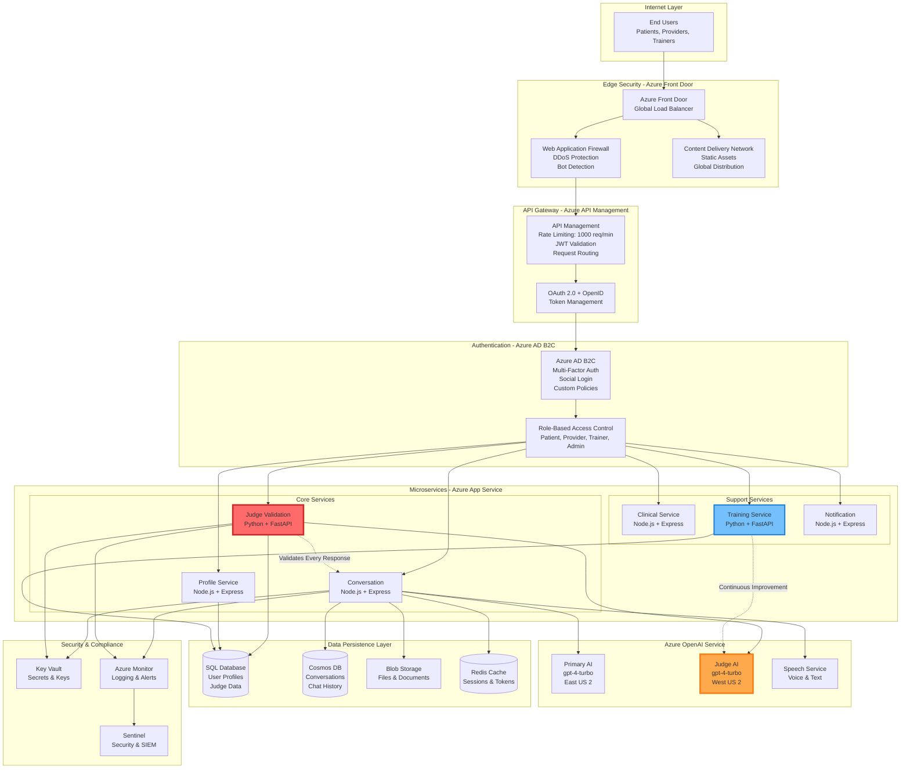

# ZIA Women's Health AI Assistant
##  Technical Documentation

---

## 1. High-Level System Architecture

---

## 2. LLM-as-a-Judge Quality Validation System - Detailed Architecture

```mermaid
graph TB
    subgraph PatientInteraction["Patient Interaction"]
        INPUT[Patient Question<br/>Text or Voice]
    end
    
    subgraph PrimaryAI["Primary AI Processing"]
        CONTEXT[Load Context<br/>User Profile<br/>Medical History]
        
        PROMPT[Build Prompt<br/>System Instructions<br/>User Context]
        
        GENERATE[Azure OpenAI API Call<br/>gpt-4-turbo<br/>Temperature: 0.3<br/>Max tokens: 1500]
        
        RESPONSE[AI Response Generated<br/>Natural language answer]
    end
    
    subgraph MandatoryGate["MANDATORY VALIDATION GATE"]
        INTERCEPT[Response Interceptor<br/>NO BYPASS POSSIBLE<br/>100% Coverage]
    end
    
    subgraph JudgeSystem["JUDGE VALIDATION SERVICE"]






        direction TB
        
        JUDGEAPI[Judge API Endpoint<br/>POST /api/judge/evaluate]
        
        subgraph EvaluationEngine["Evaluation Engine"]
            PARSE[Parse Request<br/>Query & Response<br/>Context Analysis]
            
            BUILD[Build Judge Prompt<br/>Specialized evaluation<br/>instructions]
            
            CALL[Azure OpenAI Judge<br/>gpt-4-turbo<br/>Temperature: 0.1<br/>Structured output]
        end
        
        subgraph CriteriaEvaluation["5-Criteria Assessment"]
            SAFETY[Safety<br/>30%]
            ACCURACY[Accuracy<br/>25%]
            PRIVACY[Privacy<br/>20%]
            TONE[Experience<br/>15%]
            COMPLIANCE[Compliance<br/>10%]
        end
        
        subgraph Scoring["Scoring & Decision"]
            CALCULATE[Calculate Overall Score<br/>Weighted average<br/>Score = Sum of criteria x weight]
            
            THRESHOLD{Decision Logic<br/>Score Analysis}
            
            PASS[PASS<br/>Score ≥ 85<br/>Approved for display]
            
            REVISE[REVISE<br/>Score 60-84<br/>Needs improvement]
            
            ESCALATE[ESCALATE<br/>Score < 60<br/>Human review required]
        end
        
        AUDIT[Audit Logger<br/>Evaluation Record<br/>7-year Retention]
    end
    
    subgraph Outcomes["Decision Outcomes"]
        DISPLAY[Display to Patient<br/>Response approved<br/>Conversation continues]
        
        RETRY[Return to Primary AI<br/>With specific feedback<br/>Max 3 attempts]
        
        QUEUE[Escalation Queue<br/>Provider notification<br/>Trainer review<br/>Patient informed]
    end
    
    subgraph TrainingLoop["Training & Improvement"]
        TRAINQUEUE[Training Review Queue<br/>Remote medical professionals]
        
        REVIEW[Physician Review<br/>• Validate decision<br/>• Provide corrections<br/>• Flag issues]
        
        FEEDBACK[Feedback Collection<br/>• Correct answers<br/>• Reasoning<br/>• Edge cases]
        
        IMPROVE[Model Improvement<br/>• Update prompts<br/>• Adjust weights<br/>• Refine rules]
    end
    
    INPUT --> CONTEXT
    CONTEXT --> PROMPT
    PROMPT --> GENERATE
    GENERATE --> RESPONSE
    RESPONSE --> INTERCEPT
    
    INTERCEPT --> JUDGEAPI
    JUDGEAPI --> PARSE
    PARSE --> BUILD
    BUILD --> CALL
    
    CALL --> SAFETY
    CALL --> ACCURACY
    CALL --> PRIVACY
    CALL --> TONE
    CALL --> COMPLIANCE
    
    SAFETY --> CALCULATE
    ACCURACY --> CALCULATE
    PRIVACY --> CALCULATE
    TONE --> CALCULATE
    COMPLIANCE --> CALCULATE
    
    CALCULATE --> THRESHOLD
    CALCULATE --> AUDIT
    
    THRESHOLD -->|≥85| PASS
    THRESHOLD -->|60-84| REVISE
    THRESHOLD -->|<60| ESCALATE
    
    PASS --> DISPLAY
    REVISE --> RETRY
    RETRY --> PROMPT
    ESCALATE --> QUEUE
    
    QUEUE --> TRAINQUEUE
    TRAINQUEUE --> REVIEW
    REVIEW --> FEEDBACK
    FEEDBACK --> IMPROVE
    IMPROVE -.->|Continuous Learning| BUILD
    
    style INTERCEPT fill:#ff6b6b,stroke:#c92a2a,stroke-width:4px
    style JudgeSystem fill:#fff5f5,stroke:#ff6b6b,stroke-width:3px
    style SAFETY fill:#ffe3e3,stroke:#ff6b6b,stroke-width:2px
    style ACCURACY fill:#e3fafc,stroke:#1098ad,stroke-width:2px
    style PRIVACY fill:#d0ebff,stroke:#1971c2,stroke-width:2px
    style ESCALATE fill:#ffe3e3,stroke:#ff6b6b,stroke-width:2px
    style TRAINQUEUE fill:#d0ebff,stroke:#1971c2,stroke-width:2px
```

---

## 3. Judge Evaluation Criteria - Detailed Breakdown

### Configurable Rubric System

The Judge evaluation system uses a configurable rubric-based scoring framework that can be adjusted by administrators and medical trainers without code changes.

**Configuration Parameters:**
- **Criteria Weights**: Adjustable percentage allocation (must sum to 100%)
- **Score Thresholds**: Configurable pass/revise/escalate boundaries
- **Sub-criteria Rules**: Enable/disable specific evaluation checks
- **Domain-Specific Rules**: Custom medical guideline enforcement

**Default Configuration (MVP):**
- Safety: 30% weight, minimum score 85
- Accuracy: 25% weight, minimum score 80
- Privacy: 20% weight, minimum score 90
- Experience: 15% weight, minimum score 75
- Compliance: 10% weight, minimum score 85
- Overall thresholds: Pass ≥85, Revise 60-84, Escalate <60
- Maximum retry attempts: 3

**Admin Configuration Interface:**
Administrators can adjust rubric weights and thresholds through the Admin Dashboard → System Configuration → Judge Settings without requiring code deployment.

---

## 3.1 Patient Demographics & Profile Structure

The Profile Service manages comprehensive patient information required for personalized AI responses and clinical context.

### Core Patient Profile Categories

**1. Demographics**
- Name, date of birth, age, preferred name, pronouns
- Language preference, timezone
- Contact information (encrypted)

**2. Contact Information**
- Email and phone (encrypted)
- Emergency contact details with relationship

**3. Medical History**
- Chronic and acute conditions with diagnosis dates
- Medication allergies with severity levels
- Current and past medications with dosages
- Surgical history
- Family medical history

**4. Reproductive Health**
- Menstrual cycle tracking (last period, cycle length, symptoms)
- Pregnancy status and history
- Contraception methods
- Complications and risk factors

**5. Lifestyle Factors**
- Exercise frequency and type
- Dietary preferences and restrictions
- Smoking and alcohol consumption
- Sleep patterns and stress levels
- Occupation and work environment

**6. Communication Preferences**
- Preferred interaction mode (chat, voice, or both)
- Notification settings (email, SMS, push)
- Appointment reminder preferences
- Privacy level settings

**7. Clinical Metrics**
- Height, weight, BMI (auto-calculated)
- Blood type and vital signs history
- Recent measurements with timestamps

**8. Insurance Information**
- Provider name and policy details (encrypted)
- Coverage dates and status

**9. Consent Records**
- HIPAA consent with timestamp and IP address
- Data sharing permissions (providers, research)
- Consent modification history

**10. Account Metadata**
- Account creation date
- Last login timestamp
- Profile completeness percentage
- User tier level (free, premium, enterprise)

### Data Security & Privacy
- **Encryption**: All PHI fields encrypted at rest using AES-256
- **Access Control**: Field-level RBAC - patients see all, providers see clinical subset
- **Audit Trail**: All profile access logged with timestamp and accessor ID
- **Data Retention**: Configurable per jurisdiction (default 7 years post-last activity)
- **Right to Erasure**: GDPR-compliant deletion with audit log preservation

---

## 4. Physician Training Portal - Detailed Workflow

---

## 5. Complete Patient Journey with Judge Integration

```mermaid
sequenceDiagram
    autonumber
    
    participant P as Patient<br/>(Mobile/Web)
    participant UI as React UI
    participant API as API Gateway
    participant AUTH as Auth Service
    participant CONV as Conversation<br/>Service
    participant REDIS as Redis Cache<br/>(Token Check)
    participant AI as Primary AI<br/>(Azure OpenAI)
    participant JUDGE as Judge Validation<br/>Service
    participant JAI as Judge AI<br/>(Azure OpenAI)
    participant DB as Database<br/>(SQL + Cosmos)
    participant TRAIN as Training<br/>Portal
    
    P->>UI: Opens app
    UI->>API: Request authentication
    API->>AUTH: Validate credentials
    AUTH->>AUTH: Check MFA
    AUTH-->>UI: JWT token
    
    P->>UI: Types health question
    UI->>API: POST /conversations/message
    API->>AUTH: Validate JWT
    AUTH-->>API: Token valid
    
    API->>REDIS: Check token limit
    REDIS-->>API: Tokens available
    
    API->>CONV: Forward message
    CONV->>DB: Load user context
    DB-->>CONV: Profile + history
    
    CONV->>AI: Generate response
    Note over AI: Temperature: 0.3<br/>Max tokens: 1500
    AI-->>CONV: AI response text
    
    Note over CONV,JUDGE: MANDATORY VALIDATION<br/>NO BYPASS ALLOWED
    
    CONV->>JUDGE: POST /judge/evaluate
    Note over JUDGE: Request includes:<br/>• Original query<br/>• AI response<br/>• User context<br/>• Urgency level
    
    JUDGE->>JAI: Evaluate response
    Note over JAI: 5 Criteria Assessment:<br/>Safety 30%<br/>Accuracy 25%<br/>Privacy 20%<br/>Experience 15%<br/>Compliance 10%
    
    JAI-->>JUDGE: Evaluation results
    JUDGE->>JUDGE: Calculate overall score
    JUDGE->>DB: Save evaluation record
    
    alt Score ≥ 85 (PASS)
        JUDGE-->>CONV: Approved
        CONV->>DB: Save conversation
        CONV->>REDIS: Deduct tokens
        CONV-->>API: Response approved
        API-->>UI: Display message
        UI-->>P: Show AI response
        JUDGE->>TRAIN: Log for training review
        
    else Score 60-84 (REVISE)
        JUDGE-->>CONV: Needs revision
        Note over CONV: Feedback:<br/>• Specific issues<br/>• Improvement areas<br/>• Retry guidance
        CONV->>AI: Regenerate with feedback
        AI-->>CONV: Revised response
        Note over CONV: Retry up to 3 times
        CONV->>JUDGE: Re-evaluate
        
    else Score < 60 (ESCALATE)
        JUDGE-->>CONV: Escalated
        JUDGE->>DB: Create escalation record
        JUDGE->>TRAIN: Add to review queue
        TRAIN->>TRAIN: Notify physician trainers
        CONV-->>API: Escalation message
        API-->>UI: Provider response message
        UI-->>P: "A provider will respond<br/>within 2 hours"
    end
```

---
## 6. Admin Dashboard & System Management

```mermaid
graph TB
    ADMIN[Administrator Login<br/>Super Admin Role] --> DASH[Admin Dashboard<br/>System Control Center]
    
    DASH --> USERS[👥 User Management]
    DASH --> SYSTEM[🖥️ System Monitoring]
    DASH --> AUDIT[Audit Logs & Compliance]
    DASH --> ANALYTICS[Platform Analytics]
    DASH --> CONTENT[📝 Content Management]
    DASH --> CONFIG[System Configuration]
    
    USERS --> USERMGMT[User Administration<br/>• Create/delete users<br/>• Assign roles<br/>• Bulk import CSV<br/>• Status management<br/>• Password reset]
    
    USERMGMT --> ROLEMGMT[Role Management<br/>Patient, Provider,<br/>Trainer, Admin roles]
    
    SYSTEM --> HEALTH[System Health Dashboard<br/>• API response times<br/>• Database performance<br/>• AI service status<br/>• Error rates<br/>• Resource utilization<br/>• Queue depths]
    
    HEALTH --> SERVICES[Service Status<br/>• Conversation Service<br/>• Judge Service<br/>• Profile Service<br/>• Clinical Service<br/>• Training Service<br/>• Notification Service]
    
    SERVICES --> AIHEALTH[AI Service Health<br/>• Primary AI latency<br/>• Judge AI latency<br/>• Token usage<br/>• Rate limits<br/>• Error rates]
    
    AUDIT --> LOGS[Audit Log Viewer<br/>• User authentication<br/>• Data access events<br/>• Configuration changes<br/>• API calls<br/>• System modifications]
    
    LOGS --> SEARCH[Advanced Search & Filter<br/>• Date range<br/>• User filter<br/>• Action type<br/>• Resource type<br/>• IP address]
    
    SEARCH --> EXPORTAUDIT[Export Audit Logs<br/>• PDF reports<br/>• CSV export<br/>• JSON format<br/>• HIPAA compliance package]
    
    ANALYTICS --> METRICS[Platform Metrics<br/>• Total users<br/>• Active users<br/>• Conversation volume<br/>• Feature usage<br/>• Judge performance<br/>• Escalation rates]
    
    METRICS --> REPORTS[Generate Reports<br/>• Daily/Weekly/Monthly<br/>• Custom date range<br/>• Automated delivery<br/>• Executive summary]
    
    CONTENT --> MANAGE[Content Management<br/>• Message templates<br/>• Educational content<br/>• System messages<br/>• FAQ database<br/>• Email templates<br/>• Localization strings]
    
    MANAGE --> APPROVAL[Content Approval Workflow<br/>Medical review required]
    
    CONFIG --> SETTINGS[System Settings<br/>• Feature flags<br/>• Rate limits<br/>• Token allocations<br/>• Judge thresholds<br/>• Email/SMS providers<br/>• Integration keys]
    
    SETTINGS --> FEATURES[Feature Flags<br/>• Enable/disable features<br/>• A/B testing<br/>• Gradual rollout<br/>• Emergency kill switch]
    
    SETTINGS --> INTEGRATIONS[Integration Configuration<br/>• Azure OpenAI keys<br/>• Twilio credentials<br/>• SendGrid API<br/>• EMR system endpoints<br/>• Payment gateway]
    
    HEALTH --> ALERTS[Alert Management<br/>• Configure thresholds<br/>• Notification rules<br/>• Escalation paths<br/>• On-call schedules]
    
    ALERTS --> ONCALL[On-Call Management<br/>• Rotation schedules<br/>• Contact methods<br/>• Response SLAs]
    
    style DASH fill:#ffcc99,stroke:#ff6600,stroke-width:2px
    style AUDIT fill:#ff9999,stroke:#cc0000,stroke-width:2px
    style ALERTS fill:#fff3bf,stroke:#f59f00,stroke-width:2px
```

**Key Features:**
- **Comprehensive User Management**: Full CRUD operations with role-based access control
- **Real-time System Monitoring**: Track all services, APIs, and AI health metrics
- **Audit Trail Compliance**: Searchable logs with 7-year retention for HIPAA compliance
- **Platform Analytics**: Business intelligence dashboard with custom reporting
- **Content Management**: Medical content approval workflow with version control
- **System Configuration**: Centralized configuration management with feature flags

**Technology Stack:**
- **Frontend**: React 18 + TypeScript with Recharts for analytics visualizations
- **Backend**: Node.js + Express for admin API services
- **Database**: PostgreSQL (Azure Database for PostgreSQL) for admin data

### 14.1 Basic Usage Analytics (MVP Feature)

The Admin Dashboard includes essential analytics for launch and early growth phases.

**MVP Analytics Dashboard Widgets:**

1. **User Metrics (Real-time)**
   - Total registered users
   - Active users (today/week/month)
   - New signups (daily trend)
   - User tier distribution (Free/Premium/Enterprise)
   - Churn rate (monthly)

2. **Conversation Metrics**
   - Total conversations (lifetime)
   - Conversations per day (7-day trend)
   - Average messages per conversation
   - Voice vs text interaction ratio
   - Session duration (average/median)

3. **Judge Performance (Basic)**
   - Total evaluations performed
   - Pass rate (≥85 score)
   - Revise rate (60-84 score)
   - Escalation rate (<60 score)
   - Average evaluation time

4. **Provider Activity**
   - Active providers count
   - Average response time to escalations
   - Cases resolved per provider
   - Patient satisfaction ratings (if collected)

5. **System Health (Snapshot)**
   - API uptime percentage
   - Average response time (ms)
   - Error rate (%)
   - Active user sessions
   - Token consumption rate

**Export Options:**
- CSV download for all metrics
- Weekly email summary to admins
- Monthly executive report (PDF)

**Advanced Analytics :**
- Cohort analysis
- Funnel conversion tracking
- Feature adoption rates
- Revenue analytics
- Predictive churn modeling

---

---
